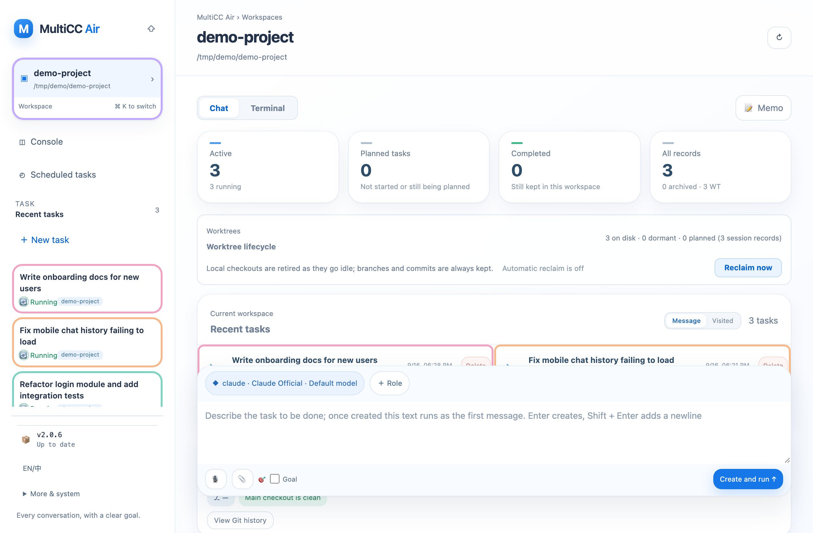
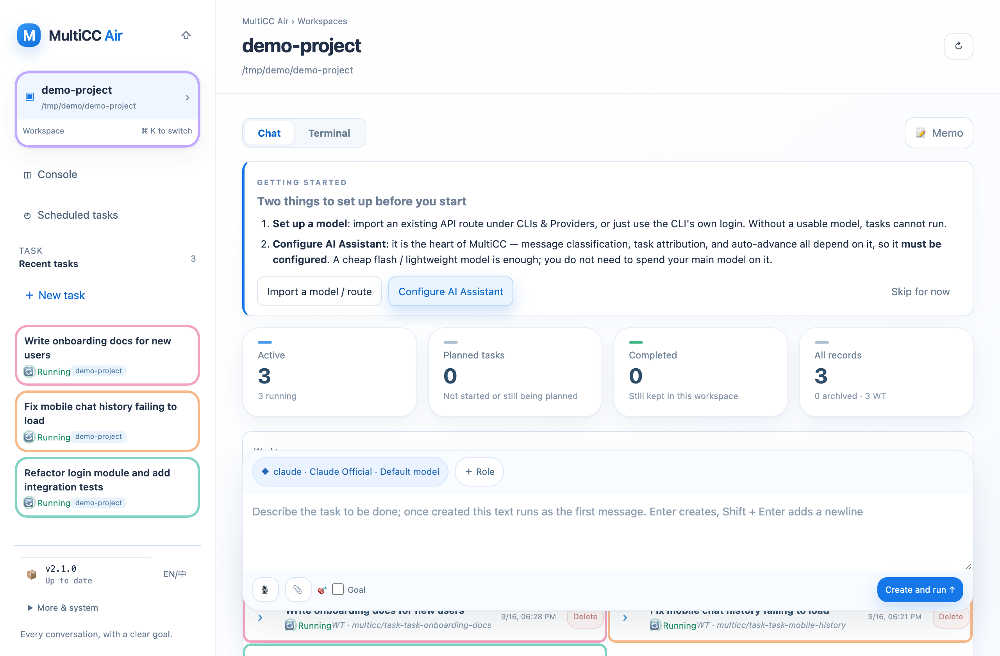
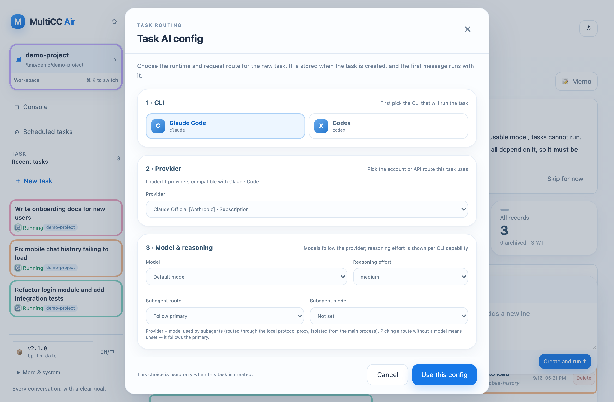
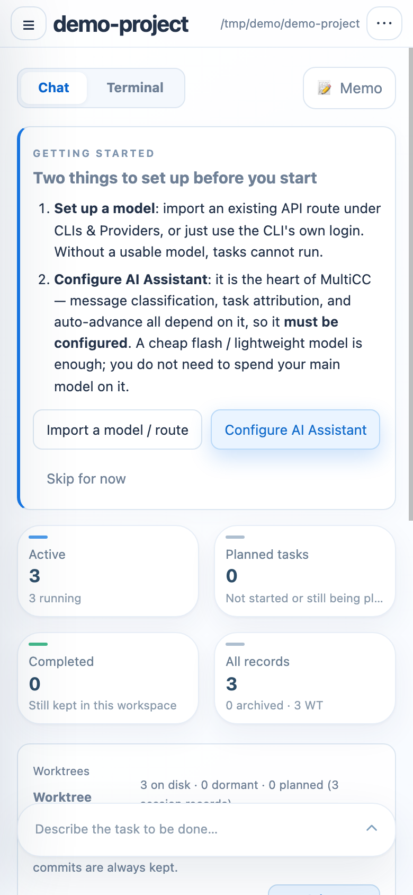
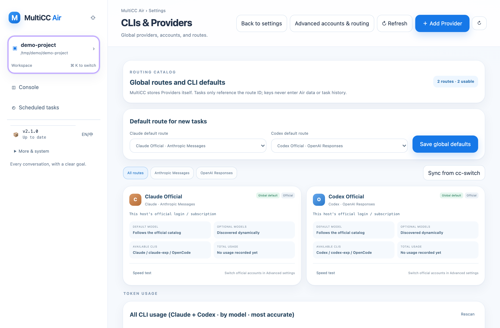
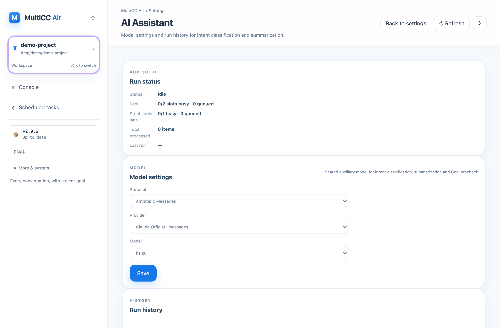

<p align="center">
  
</p>

<h1 align="center">MultiCC</h1>

<p align="center">
  <strong>One conversation. Eight coding CLIs. Switch between them mid-task without losing context.</strong>
</p>

<p align="center">
  <em>Claude Code · Codex · OpenCode · ZCode · Kimi Code · Qoder · WorkBuddy · DSH — same chat, same repo, same task.<br/>
  Run them in parallel across isolated git worktrees, and drive it all from your desk, your phone, or IM.</em>
</p>

<p align="center">
  <a href="#the-headline-one-chat-eight-clis">Multi-CLI switching</a> &bull;
  <a href="#quick-start">Quick Start</a> &bull;
  <a href="#what-else-it-does">Features</a> &bull;
  <a href="#documentation">Docs</a> &bull;
  <a href="#how-multicc-compares">Comparison</a> &bull;
  <a href="#faq">FAQ</a>
</p>

<p align="center">
  
  =22.16" />
  
  
  
  
  
</p>

<!--
  DEMO ASSET PLACEHOLDER — see docs/images/README.md
  Record a GIF of the CLI switcher (claude → codex → back to claude, mid-task),
  save it as docs/images/cli-switch.gif, then uncomment the block below.

<p align="center">
  
  <br/>
  <sub><i>Switching a running task from Claude Code to Codex — and back — without re-explaining anything.</i></sub>
</p>
-->

---

## The headline: one chat, eight CLIs

You are three hours into a refactor with Claude Code. You want a second opinion from Codex, or your Anthropic quota just ran out, or GLM is simply cheaper for the next mechanical stretch.

Normally that means a new terminal, a new session, and re-explaining everything.

In MultiCC it is one click. The **conversation** is yours; the CLI is just the engine currently driving it.

```
                 ┌────────────────────────────────────────────────┐
   your chat ───▶│  goal · phase · recent messages · git state     │
                 └───────────────┬────────────────────────────────┘
                                 │  bounded checkpoint
      ┌──────────┬───────────────┼───────────────┬──────────┬─────────┬──────────┬──────┐
      ▼          ▼               ▼               ▼          ▼         ▼          ▼      ▼
   claude      codex         opencode          zcode      kimi      qoder   workbuddy   dsh
      └──────────┴───────────────┴───────────────┴──────────┴─────────┴──────────┴──────┘
        each keeps its own native session — switch back and it resumes
```

### What actually carries over

MultiCC does **not** try to translate one vendor's transcript into another's format. That is lossy in ways you cannot audit. Instead every CLI keeps **its own native session**, and continuity between them is an explicit, bounded, **visible-text checkpoint**:

| ✅ Carried over | ❌ Not carried over |
|---|---|
| Up to 16 recent messages / 12 000 chars of visible transcript | The source CLI's hidden internal state |
| Task state — goal, phase, latest summary | The other vendor's system prompt or cached reasoning |
| Git snapshot — HEAD, branch, working-tree changes | Anything the source CLI never printed |
| Your working directory and git worktree (unchanged) | |

The receiving CLI is told, in the prompt, not to pretend otherwise:

> *Continue the current user request using this checkpoint. Do not claim access to the source CLI's hidden state.*

### Switch back and it picks up where it left off

Each CLI remembers its own native session id, model, effort, provider and subagent routing. Claude → Codex → Claude returns you to **the Claude conversation that already exists**, brought up to date with a fresh checkpoint — not a blank slate. Pass `fresh: true` when you *want* the clean slate.

Clearing a chat invalidates **all** native sessions, so a switch can never resurrect context you deliberately discarded.

### Missing a CLI? Install it from the switcher

The picker shows which CLIs are installed, which already hold a saved session, and offers one-click installation for the ones that are missing (`claude`, `codex`, `opencode`, `kimi`, `qoder`, `codebuddy`, `dsh`; ZCode ships inside its desktop app).

**→ Full details: [Multi-CLI switching](docs/cli-switching.md)**

> Multi-CLI switching applies to **chat** sessions. Terminal sessions stay pinned to the CLI they were created with.

---

## The Air console

`/air` is MultiCC's home screen — both `/` and the old `/manage` now redirect there. Tasks, not roles, are the unit of work: you describe what you want done, and each task carries its own bound session, worktree, and transcript.



- **Directory home** — every registered repo with its tasks and sessions in one list
- **New-task composer** — describe a goal, pick a CLI / line / model (it remembers your last choice), and the task spins up a bound session
- **Full-history search** — search task titles and excerpts, or include complete conversation history with ranked, highlighted matches
- **Fast directory switching** — hover the directory card to switch instantly, and drag directories into a persistent order
- **Native control center** — providers, official accounts, relay connections, workspace reclamation, schedules, AI Assistant, and host operations all live in Air
- **Delivery state at a glance** — task rows show worktrees with uncommitted changes or commits still waiting to merge
- **Scheduled tasks** — cron-style recurring work bound to fixed Air tasks
- **Task pins** — pin up to five tasks to the header tab row (sidebar top on mobile and in the app)
- **Input target** — see and switch which task your next message lands in from the full-history index (the ◎ marker); in-flight turns stay durably queued
- **Attribution controls** — accept or reject the AI Assistant's task suggestion inline, re-attribute a whole turn by hand, or split it into a durable independent continuation

**→ First run, task graph, memory graph, console pages: [Features](docs/features.md)**

---

## Why people run it

| | |
|---|---|
| 🔄 **Not locked to one vendor** | Quota exhausted, model deprecated, or a task better suited to another engine — switch instead of starting over. |
| 🧵 **Real parallelism** | Each session gets its own git worktree on branch `multicc/<sessionId>`. Eight agents, one repo, no stepping on each other. Merge back through a syntax-gated API. |
| 💸 **Cheap subagents** | Main agent on a frontier model, subagents routed to DeepSeek / GLM / Qwen through a local provider router. Same repo, in parallel, at a fraction of the cost. |
| 📱 **Sessions outlive the client** | Close the laptop mid-task; pick it up on your phone. Terminal sessions live in `tmux`, chat sessions as stateful turns. |
| 🗣️ **Voice, including full duplex** | Dictate prompts, or hold a real-time speech-to-speech conversation with your agent while your hands are busy. |
| 🔔 **It finds you** | Web Push, Bark, webhooks, and bridges to WeChat, Feishu, Telegram, Discord and Slack. |

---

## Quick Start

### 1. Install

```bash
# macOS / Linux
curl -sSL https://raw.githubusercontent.com/lsjwzh/MultiCC/v2.1.0/install.sh | bash
```

```powershell
# Windows PowerShell
irm https://raw.githubusercontent.com/lsjwzh/MultiCC/v2.1.0/install.ps1 | iex
```

One line, no flags: the tag in the URL *is* the version. The script downloads that
release's **standalone package** — the server plus a pinned Node runtime plus every
production dependency, in one archive — verifies its SHA-256, installs it at the
stable `~/MultiCC` path (`%USERPROFILE%\MultiCC` on Windows), clears macOS download quarantine, generates an
`ACCESS_TOKEN`, starts the service and opens the browser, and optionally registers
a login service (macOS `launchd` / Linux systemd user / Windows Startup). The UI is ready when
the command returns. Nothing is compiled, and **the target machine needs no Node,
npm, Homebrew or Xcode**. MultiCC does require a working `git` at runtime because
every session gets its own worktree; the installer checks it and prints the shortest
platform-specific fix when it is missing.

<details>
<summary>Install options, and building from source</summary>

```bash
# Install somewhere else (default ~/MultiCC), or skip the auto-start question
curl -sSL .../install.sh | bash -s -- --dir /opt/multicc --no-service

# Always the newest release, instead of the tag in the URL
curl -sSL .../install.sh | bash -s -- --version latest

# From a package you already downloaded
curl -sSL .../install.sh | bash -s -- --from ./multicc-standalone-2.1.0-darwin-arm64.tar.gz

# Server/automation installs: install without starting, or start without a browser
curl -sSL .../install.sh | bash -s -- --no-start
curl -sSL .../install.sh | bash -s -- --no-open
```

Windows exposes the same choices as PowerShell parameters (`-InstallDir`,
`-Version`, `-From`, `-AccessToken`, `-Port`, `-NoService`, `-NoStart`,
`-NoOpen`). Download `install.ps1` first when passing options; the flagless
`irm ... | iex` command above remains the normal path.

To hack on MultiCC itself, run it from a checkout — that path is for developers, and
`./multicc update` there is a `git pull` + `npm install`:

```bash
git clone https://github.com/lsjwzh/MultiCC.git
cd MultiCC && npm install && node server.js
```

</details>

**Prerequisites:** a working `git`, `tmux` (terminal mode only), and at least one
coding CLI on your `PATH`, already logged in. Node.js is **not** required — the
package brings its own.

<details>
<summary><strong>Not a terminal person? Install the desktop app instead</strong> (macOS / Windows / Linux)</summary>

MultiCC ships as a regular desktop application — double-click the icon and the whole
stack (backend + web UI) starts locally. No Node, no CLI commands, no ports to
remember.

1. Grab the installer for your platform from the
   **[Releases](https://github.com/lsjwzh/MultiCC/releases)** page:
   `multicc-desktop-<version>-macos-arm64/x64.dmg`, `-windows-x64.exe`, or
   `-linux-x64.AppImage` / `.deb` (each has a `.sha256` sidecar; `SHA256SUMS.txt`
   covers everything).
2. Launch it. A splash window starts the backend on a local loopback port and the
   UI opens automatically once it is ready.
3. Data, settings, and logs live in the standard per-user app folder — nothing in
   a terminal, nothing in the repo. Updates arrive as new installers.

On a Mac that cannot run it (the Electron shell needs macOS 13+, and Homebrew no
longer builds Intel bottles), use the one-line install above instead — the desktop
app and the installer ship **the same standalone tree**, just with a window around
it. It supports macOS 11+ including Intel Macs:
`multicc-standalone-<version>-darwin-x64.tar.gz`.

Stable releases include native desktop installers; developers can run the shell
from source with `npm run desktop:dev`.

**→ Install, first launch, startup failures, data/log locations, security model,
signing status: [Desktop app](docs/desktop.md)** — or, for old/Intel Macs and
machines without a window manager, the **[standalone package](docs/standalone.md)**.

</details>

Android APKs are built once by the GitHub release workflow when a `vX.Y.Z` tag is
published, signed with the project release key, and attached to that exact GitHub
Release. The **APK area in the web console** prefers a non-empty local
`public/multicc.apk`; when none exists, it links only to the `multicc.apk` asset
for the server's exact package version. It never falls forward to `latest`.
Installation and `./multicc update` never build an APK. Current stable releases
ship a signed APK asset, so the remote fallback is available immediately. The
same Release carries the **standalone packages** that
`install.sh` downloads, the desktop installers built on top of them, and their
checksums (`SHA256SUMS.txt` covers everything).

### 2. Start it

```bash
cd ~/MultiCC        # the installer's default directory (--dir changes it)
./multicc start     # from a checkout, it is the same command
```

Open **<http://localhost:3000>** — you land on the **Air console** (`/air`). Installer-created, password-protected instances also listen on the IPv4 LAN automatically; public access is never configured automatically and should use a tunnel (Tailscale Funnel, 花生壳, or SakuraFrp) — see [Configuration](docs/configuration.md).

### 3. See the point in 30 seconds

1. On `/air`, **add a directory** — point it at any git repo.
2. First run: the **setup card** walks you through preparing a model (import a provider from `cc-switch`, or just use a CLI's own login) and configuring the **AI Assistant** — a lightweight flash-tier model is enough.

   
3. Describe a goal in the **new-task composer** — *"summarise what this project does and list the three riskiest files."* — and create the task. The composer remembers your most recent CLI, line, and model.

   
4. The task binds a chat session and gets to work. Open it to watch the transcript; when it answers, click the **CLI badge in the chat header** and pick a different CLI, then send a follow-up: *"you're a different model now — do you agree with the previous assessment?"*

The second CLI answers with full awareness of the conversation, on the same branch and worktree, and tells you it is working from a handoff checkpoint. Switch back and the first CLI resumes its own session.

Then open the same URL on your phone, or install the [Flutter app](docs/installation.md#build-the-flutter-app) — the task is right there, mid-conversation.



### 4. Keep it up to date

```bash
./multicc update           # install the newest release; your data is untouched
./multicc update --check   # just compare versions
```

Installed from a package, that is the whole story: `update` downloads the new
standalone archive for your platform, verifies its SHA-256, unpacks it next to your
install, and swaps the directory in place — a detached helper waits for the running
server to exit, renames the old tree aside, moves the new one in, and restarts. If
any of that fails, the previous version is restored. Sessions, providers and chat
history live in the per-user data directory, so an update never touches them (and the
in-app update entry is disabled for packaged installs on purpose: for those, the
package *is* the upgrade).

<details>
<summary>Running from a source checkout (git semantics)</summary>

In a checkout `./multicc update` is a `git pull` + `npm install` + restart, and it
copes with an everyday dirty tree: on the dev channel it stashes your changes as
`multicc-auto-update`, fast-forwards `main`, and pops them back. `--force` is for
when that isn't enough — the pop conflicts with what was just pulled, the stable
channel's `git checkout <tag>` refuses over a local edit, or your branch carries
local commits and plain `update` just says *nothing to update*. It puts you on the
remote's code regardless: everything in the tree, **including untracked files**, goes
into a labelled `multicc-force-update-<timestamp>` stash first, then the checkout is
forced (`git reset --hard origin/main` on dev, `git checkout -f <tag>` on stable).
**Nothing is deleted, but the stash is not restored** — you land on a clean checkout
and recover your work yourself with `git stash list` / `git stash pop`. One exception:
on the stable channel `--force` still only acts when a newer release exists; at the
newest tag it stops and prints the `git checkout -f` to run by hand.

From the browser: click the **version number at the bottom of the Air console
sidebar** → a dialog shows current vs. latest and a *强制更新* checkbox → confirm, and
MultiCC runs the same update in the background, streams the log into the dialog,
restarts itself, and reloads the page once it's back. If the update fails, the dialog
keeps the full output and offers a force retry.

</details>

**→ Install flags, `./multicc` service manager, systemd unit, app builds: [Installation](docs/installation.md)**

---

## What else it does

<table>
<tr><td width="50%" valign="top">

**Sessions & orchestration**
- Two modes: full `tmux` **terminal** and a **chat** UI with tool cards and inline images
- Per-session **git worktree** on `multicc/<sessionId>`
- Merge back with **syntax-gated** validation; sibling worktrees auto-sync after a merge
- **Cross-session dispatch** — one agent hands work to another
- **Task-first MCP dispatch** — route work to an existing task or atomically create a new independent task with durable, idempotent receipts
- **Resident Claude and Codex lanes** — bounded warm processes reduce turn startup overhead while preserving each CLI's native resumable session
- **Agent Commander** — a fleet-conductor session seeded into every new directory
- Shared **task board** with a **unified task chat view** — every task owns a bound chat session with live transcript, cancel/cleanup, and stable short codes
- **Task attribution ladder** — each incoming message is matched to a task through escalating evidence, with every decision written to a durable journal you can audit and override
- Native **task graph** and **memory graph** views in the Air console
- **Scheduled message dock** — queue and review messages before they are sent
- **Hibernate idle task worktrees** — auto-suspend idle task sessions to free resources
- **run-detached** tasks, **cron** schedules, post-turn / file-change **triggers**
- Inter-agent **notes**

</td><td width="50%" valign="top">

**Models & cost**
- **Multi-provider**: bind any Anthropic- or OpenAI-compatible endpoint per CLI
- **Auto Provider routing & failover** — use ordered failover, or let Jev route simple and complex requests to different provider/model tiers before the first byte or tool side effect; evaluation failures follow a configurable safe fallback
- **AI Assistant (aux)** — intent classification, task attribution, and auto-advance; configured from its own console page (a lightweight flash-tier model is enough)
- Read-only import from **cc-switch**
- **Subagent routing** — cheap models for the grunt work, via a local provider router
- Per-provider `CODEX_HOME` isolation
- **Token accounting** — global, per-session, per-role, daily windows

</td></tr>
<tr><td width="50%" valign="top">

**Clients & reach**
- Zero-build web UI + installable **PWA**
- Native **desktop app** (Electron) for macOS / Windows / Linux — backend included, loopback-only, no terminal needed
- Native **Flutter app** for Android and iOS
- **IM bridges**: WeChat, Feishu, Telegram, Discord, Slack
- **Session sharing** via password-protected snapshot links; share links open the chat page directly
- **Cross-instance Fleet sharing** — password-protected read-only snapshots, imported and interactively driven on the other side
- **Relay-token remote sharing** — grant access and share provider configs securely from the console
- Public tunnels built in: **Tailscale Funnel**, **花生壳**, and **SakuraFrp** with live monitoring
- Web Push / Bark / webhook **notifications**
- Chinese + English UI

</td><td width="50%" valign="top">

**Voice & resilience**
- **Speech-to-speech** mode with VAD and barge-in
- Classic voice input with **on-device ASR** (sherpa-onnx SenseVoice) and LLM prompt polishing
- **Voice task announcements** — hands-free status of completed tasks
- 500-event **replay buffer** — reconnect rebuilds state deterministically
- In-process **battery guard** — opt-in sleep when running on battery below a threshold, latched until AC power or a manual rearm
- Serialized git queue, graceful shutdown/restart
- Password-gated automatic LAN binding, HMAC cookies, WebSocket tickets

</td></tr>
</table>





**→ Every feature in detail: [Features](docs/features.md)**

---

## Documentation

| Document | What's in it |
|---|---|
| **[Multi-CLI switching](docs/cli-switching.md)** | The headline feature: checkpoint format, reuse semantics, API, one-click install |
| [Installation & service management](docs/installation.md) | Install flags, updating, `./multicc` commands, systemd, Flutter builds |
| [Desktop app](docs/desktop.md) | macOS / Windows / Linux desktop installers: first launch, failures, data & log locations, security model, signing |
| [Standalone package](docs/standalone.md) | The distribution form everything else wraps: layout, `multicc` commands, updates, data locations, and why it runs on macOS 11+/Intel with no compiler and no Homebrew |
| [Browser automation on macOS 11+](skills/multicc-browser/references/mbrowser.md) | MultiCC's own `mbrowser` executor: dedicated Chrome profiles, resident CDP daemon, per-session tabs, macOS 11–12 tiers. The Python [Browser Harness route](skills/multicc-browser/references/browser-use-local.md) stays as an opt-in alternative |
| [Configuration](docs/configuration.md) | Every environment variable, providers, voice, notifications |
| [Features](docs/features.md) | The complete feature reference |
| [Architecture](docs/architecture.md) | Repository layout, message flows, design decisions |
| [API reference](docs/api-reference.md) | REST endpoints by domain + WebSocket protocol |
| [Router tools](docs/router-tools.md) | Task-first MCP contracts for durable dispatch, `new_task`, waits, secrets, and artifacts |
| [How MultiCC compares](docs/ecosystem-comparison.md) | 12-project landscape, head-to-head tables, what MultiCC is *worse* at |
| [FAQ](docs/faq.md) | Troubleshooting and common questions |
| [Tech stack](docs/tech-stack.md) | Runtime dependencies and what each one is for |

The full index — design contracts, voice, provider routing, governance reviews, and modularization history — is in **[docs/README.md](docs/README.md)** (50+ documents).

---

## Configuration in 30 seconds

Everything lives in a single env file. Installed from a package, that file is
`multicc.env` in the per-user data directory — `./multicc config path` prints it,
`./multicc config set PORT 3000` edits it. Running from a checkout it is `.env` at
the repo root. Either way the installer writes `ACCESS_TOKEN` and `PORT` for you.

```env
PORT=3000
ACCESS_TOKEN=<generated-by-install.sh>

# With a token and no explicit network policy, IPv4 LAN access is automatic.
# To force loopback-only access, set either:
# HOST=127.0.0.1
# MULTICC_ALLOW_REMOTE=0
```

Requests from loopback bypass `ACCESS_TOKEN`. MultiCC serves **plain HTTP** and does not terminate TLS — use one of the built-in tunnels (Tailscale Funnel, 花生壳, or SakuraFrp, managed from the console's host settings), ngrok, or your own reverse proxy for public access.

Providers, subagent routing, voice, TTS/ASR and notification settings are configured from the Air console; the underlying variables are documented in **[Configuration](docs/configuration.md)**.

---

## How MultiCC compares

Projects that **harness** the official CLIs — spawning and managing the real `claude` / `codex` binaries rather than reimplementing them — cluster into remote-access wrappers, web IDEs, and multi-agent orchestrators.

**Where MultiCC is the only one, or nearly so:**

- **In-place cross-CLI switching** across eight coding CLIs with a bounded handoff checkpoint
- **Task board with bound chat sessions** — every task gets a private chat transcript, short codes, and lifecycle controls
- **Scheduled messages** and **relay-token remote sharing**
- **Speech-to-speech** voice conversation with an agent, plus hands-free task announcements
- **On-device ASR** (sherpa-onnx SenseVoice) for classic voice input
- **IM bridges** to five platforms with full dispatch + reply
- **Per-session provider and subagent routing** for cost control
- **Native desktop and mobile apps**, PWA, terminal, and web chat against one backend, with signed APKs shipped on every stable release

**Where it is weaker:** no hosted/cloud option, no built-in code editor, and single-user by design — there is no team RBAC.

Surveyed: cc-switch, Ruflo, CLIProxyAPI, oh-my-claudecode, AionUi, vibe-kanban, cc-connect, CloudCLI, Superset, Orca, cockpit-tools — eleven peers, plus MultiCC itself, make up the 12-project landscape.

**→ The full 12-project survey and head-to-head tables: [How MultiCC compares](docs/ecosystem-comparison.md)**

---

## Architecture at a glance

```
    ┌──────────────┐  ┌──────────────┐  ┌──────────────┐  ┌──────────────┐
    │ Desktop Web  │  │  Mobile PWA  │  │ Flutter App  │  │ WeChat / IM  │
    │ (Terminal)   │  │   (Chat)     │  │ Android/iOS  │  │   Bridges    │
    └──────┬───────┘  └──────┬───────┘  └──────┬───────┘  └──────┬───────┘
           │                 │                 │                 │
           ▼                 ▼                 ▼                 ▼
    ┌───────────────────────────────────────────────────────────────────┐
    │           MultiCC Server  (Express + ws, authenticated LAN HTTP)  │
    │  ┌────────────────────┐  ┌───────────────┐  ┌──────────────────┐  │
    │  │ tmux backend       │  │ CLI spawner   │  │ cli-switch       │  │
    │  │ (terminal mode)    │  │ (chat mode)   │  │ + handoff        │  │
    │  └─────────┬──────────┘  └───────┬───────┘  └────────┬─────────┘  │
    │            ▼                     ▼                   ▼            │
    │      claude / codex …    8 CLI adapters      per-CLI native       │
    │                          (stream-json, exec) session state        │
    └───────────────────────────────────────────────────────────────────┘
                                     │
                    per-session git worktree: multicc/<sessionId>
```

Key decisions: vendor transcripts are never translated; authoritative conversation and provider records remain inspectable local files, while orchestration and rebuildable search indexes use `node:sqlite`; each session owns a branch and worktree; the network bind is fail-closed. The desktop app adds one more client without adding a second UI — it embeds this same server and serves this same web page from a loopback port.

**Built with:** Node.js · Express · ws · node:sqlite (built into Node 22.16+, so there is no compiled SQLite addon) · sherpa-onnx (on-device ASR) · cli-provider-router · chokidar · tmux · Flutter · Electron (desktop shell). No frontend build step — the web client is plain JavaScript.

**→ [Architecture](docs/architecture.md)**

---

## API

MultiCC exposes a complete REST + WebSocket API — sessions, git, providers, voice, notifications, task board, sharing, tunnels.

```bash
# Switch a live chat to another CLI
curl -X POST "http://localhost:3000/api/sessions/$SESSION_ID/switch-cli" \
  -H 'Content-Type: application/json' -d '{"cli":"codex"}'
```

**→ [API reference](docs/api-reference.md)**

---

## FAQ

A few of the most common questions:

- **Is there a desktop app?** Yes — macOS (dmg), Windows (exe), and Linux (AppImage/deb) installers ship on the Releases page. Double-click and everything (backend + UI) starts locally; no Node, no terminal. See [Desktop app](docs/desktop.md).
- **Does MultiCC serve HTTPS?** No — direct LAN access is plain HTTP. Use `http://localhost` for microphone and PWA features, or a tunnel that terminates real TLS.
- **Can I use it without Claude Code?** Yes. Any one of the eight supported CLIs is enough.
- **Does switching CLIs cost tokens immediately?** No. The checkpoint is queued and delivered with your *next* message.
- **Port already in use?** Set a different `PORT` in `.env` — automatic rollover only happens in development mode.
- **`./multicc update` stopped, or says "nothing to update" while I'm behind?** `./multicc update --force` puts you on the remote's code. Local changes are stashed as `multicc-force-update-<ts>` and not restored — see [Keep it up to date](#4-keep-it-up-to-date).

**→ [Full FAQ](docs/faq.md)**

---

## 中文用户

MultiCC 的核心卖点是：**同一个对话里并行运行、随时切换多个 AI 编程 CLI，上下文不丢。**
安装、30 秒上手、常见问题的中文说明见 **[README.zh.md](README.zh.md)**。界面本身支持中英文切换（默认中文）。

---

## License

MIT.

---

<p align="center">
  <sub>Built for Claude Code, Codex, OpenCode, ZCode, Kimi Code, Qoder, WorkBuddy, and DSH · <a href="https://github.com/lsjwzh/MultiCC">github.com/lsjwzh/MultiCC</a></sub>
</p>
