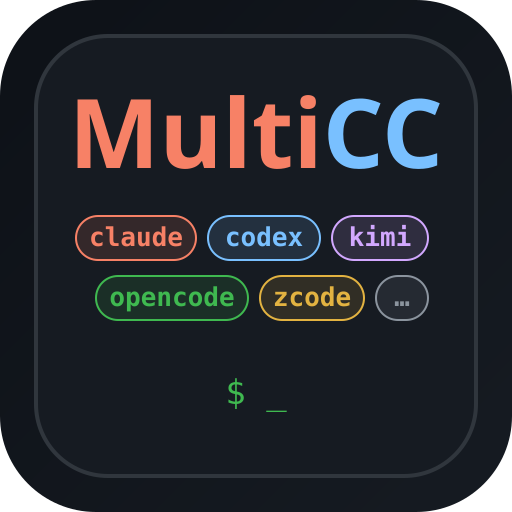

<p align="center">
  
</p>

<h1 align="center">MultiCC</h1>

<p align="center">
  <strong>One conversation. Five coding CLIs. Switch between them mid-task without losing context.</strong>
</p>

<p align="center">
  <em>Claude Code · Codex · OpenCode · ZCode · Qoder — same chat, same repo, same task.<br/>
  Run them in parallel across isolated git worktrees, and drive it all from your desk, your phone, or IM.</em>
</p>

<p align="center">
  <a href="#the-headline-one-chat-five-clis">Multi-CLI switching</a> &bull;
  <a href="#quick-start">Quick Start</a> &bull;
  <a href="#what-else-it-does">Features</a> &bull;
  <a href="#documentation">Docs</a> &bull;
  <a href="#how-multicc-compares">Comparison</a> &bull;
  <a href="#faq">FAQ</a>
</p>

<p align="center">
  
  =20.19" />
  
  
  
  
</p>

<!--
  DEMO ASSET PLACEHOLDER — see docs/images/README.md
  Record a GIF of the CLI switcher (claude → codex → back to claude, mid-task),
  save it as docs/images/cli-switch.gif, then uncomment the block below.

<p align="center">
  
  <br/>
  <sub><i>Switching a running task from Claude Code to Codex — and back — without re-explaining anything.</i></sub>
</p>
-->

---

## The headline: one chat, five CLIs

You are three hours into a refactor with Claude Code. You want a second opinion from Codex, or your Anthropic quota just ran out, or GLM is simply cheaper for the next mechanical stretch.

Normally that means a new terminal, a new session, and re-explaining everything.

In MultiCC it is one click. The **conversation** is yours; the CLI is just the engine currently driving it.

```
                 ┌────────────────────────────────────────────────┐
   your chat ───▶│  goal · phase · recent messages · git state     │
                 └───────────────┬────────────────────────────────┘
                                 │  bounded checkpoint
      ┌──────────┬───────────────┼───────────────┬──────────┐
      ▼          ▼               ▼               ▼          ▼
   claude      codex         opencode          zcode      qoder
      └──────────┴───────────────┴───────────────┴──────────┘
        each keeps its own native session — switch back and it resumes
```

### What actually carries over

MultiCC does **not** try to translate one vendor's transcript into another's format. That is lossy in ways you cannot audit. Instead every CLI keeps **its own native session**, and continuity between them is an explicit, bounded, **visible-text checkpoint**:

| ✅ Carried over | ❌ Not carried over |
|---|---|
| Up to 16 recent messages / 12 000 chars of visible transcript | The source CLI's hidden internal state |
| Task state — goal, phase, latest summary | The other vendor's system prompt or cached reasoning |
| Git snapshot — HEAD, branch, working-tree changes | Anything the source CLI never printed |
| Your working directory and git worktree (unchanged) | |

The receiving CLI is told, in the prompt, not to pretend otherwise:

> *Continue the current user request using this checkpoint. Do not claim access to the source CLI's hidden state.*

### Switch back and it picks up where it left off

Each CLI remembers its own native session id, model, effort, provider and subagent routing. Claude → Codex → Claude returns you to **the Claude conversation that already exists**, brought up to date with a fresh checkpoint — not a blank slate. Pass `fresh: true` when you *want* the clean slate.

Clearing a chat invalidates **all five** native sessions, so a switch can never resurrect context you deliberately discarded.

### Missing a CLI? Install it from the switcher

The picker shows which CLIs are installed, which already hold a saved session, and offers one-click installation for the ones that are missing (`claude`, `codex`, `opencode`, `qoder`; ZCode ships inside its desktop app).

**→ Full details: [Multi-CLI switching](docs/cli-switching.md)**

> Multi-CLI switching applies to **chat** sessions. Terminal sessions stay pinned to the CLI they were created with.

---

## Why people run it

| | |
|---|---|
| 🔄 **Not locked to one vendor** | Quota exhausted, model deprecated, or a task better suited to another engine — switch instead of starting over. |
| 🧵 **Real parallelism** | Each session gets its own git worktree on branch `multicc/<sessionId>`. Five agents, one repo, no stepping on each other. Merge back through a syntax-gated API. |
| 💸 **Cheap subagents** | Main agent on a frontier model, subagents routed to DeepSeek / GLM / Qwen through a local provider router. Same repo, in parallel, at a fraction of the cost. |
| 📱 **Sessions outlive the client** | Close the laptop mid-task; pick it up on your phone. Terminal sessions live in `tmux`, chat sessions as stateful turns. |
| 🗣️ **Voice, including full duplex** | Dictate prompts, or hold a real-time speech-to-speech conversation with your agent while your hands are busy. |
| 🔔 **It finds you** | Web Push, Bark, webhooks, and bridges to WeChat, Feishu, Telegram, Discord and Slack. |

---

## Quick Start

### 1. Install

```bash
curl -sSL https://raw.githubusercontent.com/lsjwzh/MultiCC/v1.4.0/install.sh | bash -s -- --branch v1.4.0
```

The script detects your OS, checks prerequisites, clones the repo, installs dependencies, generates an `ACCESS_TOKEN`, and optionally registers a background service (macOS `launchd`).

<details>
<summary>Manual install, or the daily <code>main</code> snapshot</summary>

```bash
# Manual
git clone https://github.com/lsjwzh/MultiCC.git
cd MultiCC && npm install && node server.js

# Bleeding edge (may include untested changes)
curl -sSL https://raw.githubusercontent.com/lsjwzh/MultiCC/main/install.sh | bash
```

</details>

**Prerequisites:** Node.js **>= 20.19**, `tmux` (terminal mode only), and at least one coding CLI on your `PATH`, already logged in. Flutter >= 3.8 only if you want to build the mobile app yourself.

### 2. Start it

```bash
cd MultiCC
./multicc start
```

Open **<http://localhost:3000/manage>**. MultiCC binds to `127.0.0.1` by default and refuses a non-loopback bind unless you opt in explicitly — see [Configuration](docs/configuration.md).

### 3. See the point in 30 seconds

1. On `/manage`, **add a directory** — point it at any git repo.
2. **New chat session** → pick `claude` (or whichever CLI you have).
3. Ask it something real: *"summarise what this project does and list the three riskiest files."*
4. When it answers, click the **CLI badge in the chat header** and pick a different CLI.
5. Send a follow-up: *"you're a different model now — do you agree with the previous assessment?"*

The second CLI answers with full awareness of the conversation, on the same branch and worktree, and tells you it is working from a handoff checkpoint. Switch back and the first CLI resumes its own session.

Then open the same URL on your phone, or install the [Flutter app](docs/installation.md#build-the-flutter-app) — the session is right there, mid-conversation.

### 4. Keep it up to date

```bash
./multicc update           # pull latest, reinstall deps if they changed, restart
./multicc update --force   # same, but don't stop for a dirty or diverged tree
```

Plain `update` refuses to touch a working tree it can't safely fast-forward — a local edit, a leftover experiment, a branch that diverged after an upstream force-push. `--force` gets you to the remote tip anyway: it first stashes everything, including untracked files, into a labelled `multicc-force-update-<timestamp>` stash, then hard-resets the branch. **Nothing is deleted, but the stash is not restored** — you land on a clean checkout and recover your work yourself with `git stash list` / `git stash pop`.

Or do it from the browser: click the **version number at the bottom of the `/manage` sidebar** → a dialog shows current vs. latest and a *强制更新* checkbox → confirm, and MultiCC runs the same update in the background, streams the log into the dialog, restarts itself, and reloads the page once it's back. If the update fails, the dialog keeps the full output and offers a force retry.

**→ Install flags, `./multicc` service manager, systemd unit, app builds: [Installation](docs/installation.md)**

---

## What else it does

<table>
<tr><td width="50%" valign="top">

**Sessions & orchestration**
- Two modes: full `tmux` **terminal** and a **chat** UI with tool cards and inline images
- Per-session **git worktree** on `multicc/<sessionId>`
- Merge back with **syntax-gated** validation; sibling worktrees auto-sync after a merge
- **Cross-session dispatch** — one agent hands work to another
- **Agent Commander** scheduling, shared **task board**, inter-agent **notes**
- **run-detached** tasks, **cron** schedules, post-turn / file-change **triggers**

</td><td width="50%" valign="top">

**Models & cost**
- **Multi-provider**: bind any Anthropic- or OpenAI-compatible endpoint per CLI
- Read-only import from **cc-switch**
- **Subagent routing** — cheap models for the grunt work, via a local provider router
- Per-provider `CODEX_HOME` isolation
- **Token accounting** — global, per-session, per-role, daily windows

</td></tr>
<tr><td width="50%" valign="top">

**Clients & reach**
- Zero-build web UI + installable **PWA**
- Native **Flutter app** for Android and iOS
- **IM bridges**: WeChat, Feishu, Telegram, Discord, Slack
- **Session sharing** via password-protected snapshot links
- Web Push / Bark / webhook **notifications**
- Chinese + English UI

</td><td width="50%" valign="top">

**Voice & resilience**
- **Speech-to-speech** mode with VAD and barge-in
- Classic voice input with **on-device ASR** (sherpa-onnx SenseVoice) and LLM prompt polishing
- 500-event **replay buffer** — reconnect rebuilds state deterministically
- Serialized git queue, graceful shutdown/restart
- Fail-closed network binding, HMAC cookies, WebSocket tickets

</td></tr>
</table>

**→ Every feature in detail: [Features](docs/features.md)**

---

## Documentation

| Document | What's in it |
|---|---|
| **[Multi-CLI switching](docs/cli-switching.md)** | The headline feature: checkpoint format, reuse semantics, API, one-click install |
| [Installation & service management](docs/installation.md) | Install flags, updating, `./multicc` commands, systemd, Flutter builds |
| [Configuration](docs/configuration.md) | Every environment variable, providers, voice, notifications |
| [Features](docs/features.md) | The complete feature reference |
| [Architecture](docs/architecture.md) | Repository layout, message flows, design decisions |
| [API reference](docs/api-reference.md) | REST endpoints by domain + WebSocket protocol |
| [How MultiCC compares](docs/ecosystem-comparison.md) | 12-project landscape, head-to-head tables, what MultiCC is *worse* at |
| [FAQ](docs/faq.md) | Troubleshooting and common questions |
| [Tech stack](docs/tech-stack.md) | Runtime dependencies and what each one is for |

The full index — design contracts, voice, provider routing, governance reviews, and modularization history — is in **[docs/README.md](docs/README.md)** (34 documents).

---

## Configuration in 30 seconds

Everything lives in `.env` at the repo root. The installer writes `ACCESS_TOKEN` and `PORT` for you.

```env
PORT=3000
ACCESS_TOKEN=<generated-by-install.sh>

# Only if you need access from other devices — both are required.
# Without MULTICC_ALLOW_REMOTE the server refuses to start on a non-loopback host.
# HOST=0.0.0.0
# MULTICC_ALLOW_REMOTE=1
```

Requests from loopback bypass `ACCESS_TOKEN`. MultiCC serves **plain HTTP** and does not terminate TLS — use Tailscale Funnel (built into `/manage` → Tunnel), ngrok, or your own reverse proxy for public access.

Providers, subagent routing, voice, TTS/ASR and notification settings are configured from `/manage`; the underlying variables are documented in **[Configuration](docs/configuration.md)**.

---

## How MultiCC compares

Projects that **harness** the official CLIs — spawning and managing the real `claude` / `codex` binaries rather than reimplementing them — cluster into remote-access wrappers, web IDEs, and multi-agent orchestrators.

**Where MultiCC is the only one, or nearly so:**

- **In-place cross-CLI switching** with a bounded handoff checkpoint
- **Speech-to-speech** voice conversation with an agent
- **IM bridges** to five platforms with full dispatch + reply
- **Per-session provider and subagent routing** for cost control
- **Native mobile app** plus terminal, chat, and PWA against one backend

**Where it is weaker:** no hosted/cloud option, no built-in code editor, macOS/Linux only, and single-user by design — there is no team RBAC.

Surveyed: cc-switch, Ruflo, CLIProxyAPI, oh-my-claudecode, AionUi, vibe-kanban, cc-connect, CloudCLI, Superset, Orca, cockpit-tools.

**→ The full 12-project survey and head-to-head tables: [How MultiCC compares](docs/ecosystem-comparison.md)**

---

## Architecture at a glance

```
    ┌──────────────┐  ┌──────────────┐  ┌──────────────┐  ┌──────────────┐
    │ Desktop Web  │  │  Mobile PWA  │  │ Flutter App  │  │ WeChat / IM  │
    │ (Terminal)   │  │   (Chat)     │  │ Android/iOS  │  │   Bridges    │
    └──────┬───────┘  └──────┬───────┘  └──────┬───────┘  └──────┬───────┘
           │                 │                 │                 │
           ▼                 ▼                 ▼                 ▼
    ┌───────────────────────────────────────────────────────────────────┐
    │              MultiCC Server  (Express + ws, loopback HTTP)        │
    │  ┌────────────────────┐  ┌───────────────┐  ┌──────────────────┐  │
    │  │ tmux backend       │  │ CLI spawner   │  │ cli-switch       │  │
    │  │ (terminal mode)    │  │ (chat mode)   │  │ + handoff        │  │
    │  └─────────┬──────────┘  └───────┬───────┘  └────────┬─────────┘  │
    │            ▼                     ▼                   ▼            │
    │      claude / codex …    5 CLI adapters      per-CLI native       │
    │                          (stream-json, exec) session state        │
    └───────────────────────────────────────────────────────────────────┘
                                     │
                    per-session git worktree: multicc/<sessionId>
```

Key decisions: vendor transcripts are never translated; state is flat JSON, not a database; each session owns a branch and worktree; the network bind is fail-closed.

**Built with:** Node.js · Express · ws · better-sqlite3 · sherpa-onnx (on-device ASR) · cli-provider-router · chokidar · tmux · Flutter. No frontend build step — the web client is plain JavaScript.

**→ [Architecture](docs/architecture.md)**

---

## API

MultiCC exposes a complete REST + WebSocket API — sessions, git, providers, voice, notifications, task board, sharing, tunnels.

```bash
# Switch a live chat to another CLI
curl -X POST "http://localhost:3000/api/sessions/$SESSION_ID/switch-cli" \
  -H 'Content-Type: application/json' -d '{"cli":"codex"}'
```

**→ [API reference](docs/api-reference.md)**

---

## FAQ

A few of the most common questions:

- **Does MultiCC serve HTTPS?** No — plain HTTP on loopback. Use `http://localhost` for microphone and PWA features, or a tunnel that terminates real TLS.
- **Can I use it without Claude Code?** Yes. Any one of the five supported CLIs is enough.
- **Does switching CLIs cost tokens immediately?** No. The checkpoint is queued and delivered with your *next* message.
- **Port already in use?** Set a different `PORT` in `.env` — automatic rollover only happens in development mode.

**→ [Full FAQ](docs/faq.md)**

---

## 中文用户

MultiCC 的核心卖点是：**同一个对话里并行运行、随时切换多个 AI 编程 CLI，上下文不丢。**
安装、30 秒上手、常见问题的中文说明见 **[README.zh.md](README.zh.md)**。界面本身支持中英文切换（默认中文）。

---

## License

MIT.

---

<p align="center">
  <sub>Built for Claude Code, Codex, OpenCode, ZCode, and Qoder · <a href="https://github.com/lsjwzh/MultiCC">github.com/lsjwzh/MultiCC</a></sub>
</p>
