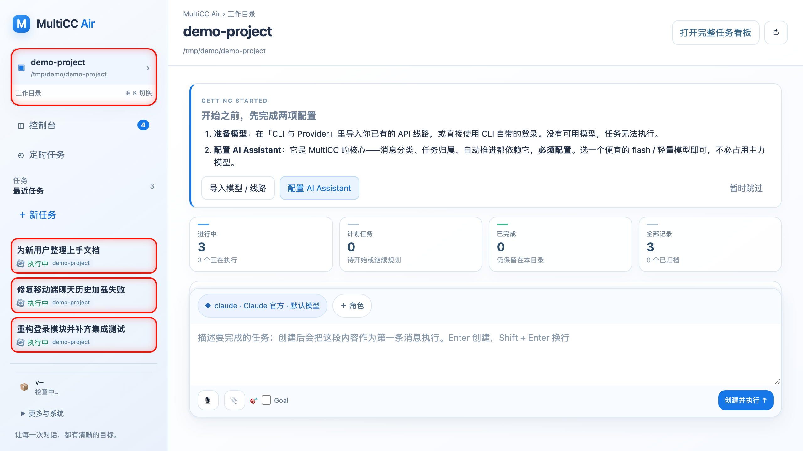
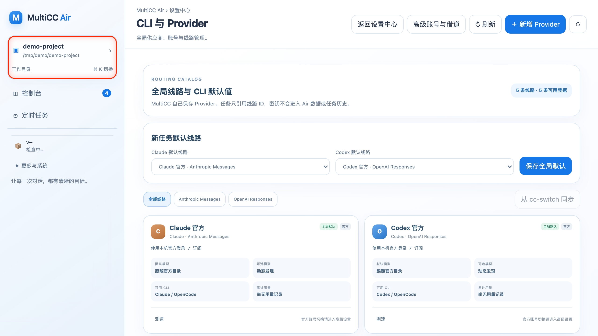
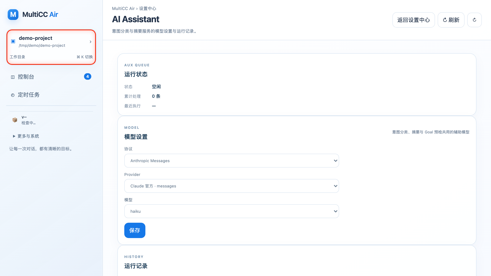
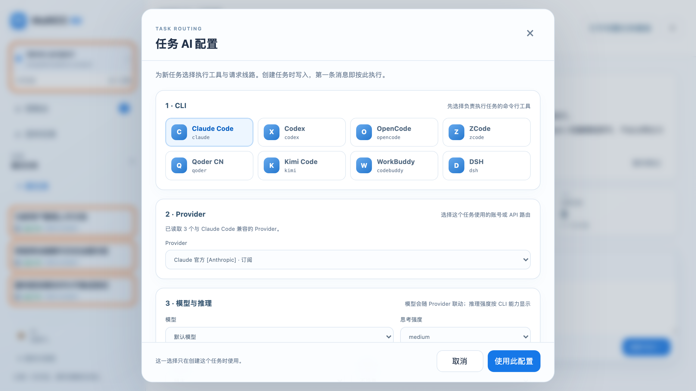
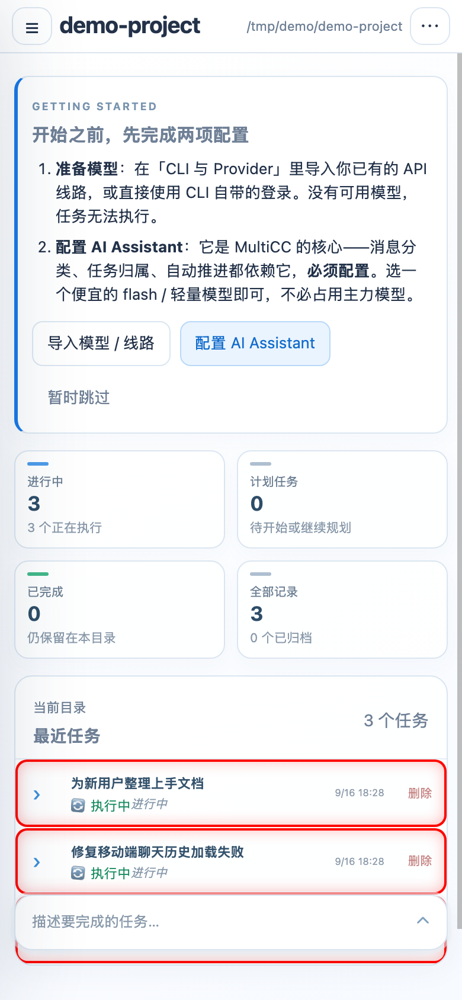

<p align="center">
  
</p>

<h1 align="center">MultiCC</h1>

<p align="center">
  <strong>一个对话，八个 AI 编程 CLI。任务进行到一半也能随时切换，上下文不丢。</strong>
</p>

<p align="center">
  <em>Claude Code · Codex · OpenCode · ZCode · Kimi Code · Qoder · WorkBuddy · DSH —— 同一个聊天、同一个仓库、同一件事。<br/>
  多个会话并行跑在互不干扰的 git worktree 里，桌面、手机、微信都能操控。</em>
</p>

<p align="center">
  <a href="README.md">English README</a>
</p>

---

> 这是一份**中文导引**，不是英文 README 的逐句翻译。完整的技术细节都在 [`docs/`](docs/) 下的分主题文档里（中英混合，逐步补全）。

## 一句话定位

MultiCC 是一个自托管的编排层：把你本机已经装好的 AI 编程 CLI，变成可以**并行、可切换、跨设备访问**的会话平台。

## 核心卖点：多 CLI 同上下文切换

你已经和 Claude Code 聊了三个小时做重构。这时你想让 Codex 给个第二意见，或者 Anthropic 额度用完了，又或者接下来那段机械活儿用 GLM 更便宜。

通常这意味着：开新终端、开新会话、把来龙去脉再讲一遍。

在 MultiCC 里这是一次点击。**对话是你的**，CLI 只是当前驱动它的引擎。

### 切过去时，什么会带走

MultiCC **不会**把一家厂商的对话记录翻译成另一家的格式——那种做法的信息损失无法审计。它的做法是：每个 CLI 保留**自己的原生会话**，会话之间的连续性由一份**有界的、纯可见文本的 checkpoint** 提供。

| ✅ 会带走 | ❌ 不会带走 |
|---|---|
| 最近 16 条消息 / 12000 字符以内的可见对话 | 源 CLI 的隐藏内部状态 |
| 任务状态：目标、阶段、最新摘要 | 另一家厂商的 system prompt、缓存推理 |
| Git 快照：HEAD、分支、工作区改动 | 源 CLI 从未打印出来的任何东西 |
| 你的工作目录和 git worktree（不变） | |

接收方 CLI 会在 prompt 里被明确告知：**不要声称自己能访问源 CLI 的隐藏状态**。

### 切回来时，会接着原来的会话

每个 CLI 都记着自己的原生会话 id、模型、思考强度、provider、子 agent 路由。Claude → Codex → Claude 切回来，回到的是**那个已经存在的 Claude 会话**，并补上一份涵盖这期间发生了什么的新 checkpoint —— 而不是一张白纸。想要白纸就传 `fresh: true`。

清空对话会同时作废**全部八个** CLI 的原生会话，所以切换永远不会把你刚删掉的上下文又捞回来。

### 缺哪个 CLI，切换弹窗里一键装

切换弹窗会显示：哪些 CLI 已安装、哪些已有会话，并为缺失的提供一键安装（`claude`、`codex`、`opencode`、`kimi`、`qoder`、`codebuddy`、`dsh`；ZCode 的 CLI 内置在其桌面版里，需要手动装）。

**→ 完整说明：[Multi-CLI switching](docs/cli-switching.md)**

> 多 CLI 切换只适用于**聊天（chat）会话**。终端会话创建时用的哪个 CLI 就固定是哪个。

---

## Air 控制台

`/air` 是 MultiCC 的主界面——`/` 和旧的 `/manage` 现在都重定向到这里。**任务，而不是角色，才是干活的单位**：你描述要做成的事，每个任务自带绑定的会话、worktree 和对话记录。



- **目录首页** —— 所有登记过的仓库、它们的任务和会话一屏可见
- **新任务输入框** —— 描述目标，选 CLI / 线路 / 模型（会记住你上次的选择），任务即建即跑
- **⌘K 搜索** —— 一个命令面板同时搜目录、任务、会话
- **内置控制台** —— Provider、定时任务、AI Assistant、主机操作，不用离开页面
- **定时任务** —— cron 式循环工作，绑定固定的 Air 任务
- **任务置顶** —— 最多置顶五个任务到顶部标签栏（移动端与 App 里在侧栏顶部）
- **输入目标** —— 在全量历史索引里用 ◎ 查看并切换下一条消息落到哪个任务；进行中的轮次会持久排队不丢
- **归属控制** —— 就地接受或驳回 AI Assistant 的任务归属建议、手动重归整轮，或把它拆成一条持久的独立续接

**→ 首启引导、任务图谱、记忆图谱、控制台各页：[Features](docs/features.md)**

---

## 还有什么

| | |
|---|---|
| 🧵 **真并行** | 每个会话独占一个 git worktree，分支 `multicc/<会话id>`。八个 agent 同仓库互不打架，合回主分支时有语法校验把关，合并后自动同步兄弟 worktree。 |
| 📋 **任务板绑定会话** | 每个任务拥有独立的隐藏聊天会话，实时台账、稳定短码 `#CODE`、取消/清理/归档释放全套生命周期；任务聊天视图与普通会话同一套渲染器。 |
| 🕸️ **任务图谱与记忆图谱** | Air 控制台原生视图：任务父子 / 分组 / 合并关系的关联网络，以及跨任务的记忆网络。 |
| 🤖 **AI Assistant (aux)** | 意图分类、任务归属、自动推进的核心服务，控制台里有独立的设置页和运行记录（轻量 flash 级模型即可）。 |
| 🪜 **任务归属阶梯** | 每条来信按递进的证据链匹配到对应任务，每个判定都写入可审计、可覆写的持久日志。 |
| ♻️ **Auto Provider 故障切换** | 上游失败时自动切到下一个健康候选线路，额度条随线路切换即时更新。 |
| 👨‍✈️ **Agent Commander** | 每个新目录自动播种一个「舰队指挥官」会话，协调专职兄弟会话，附带常用角色预设。 |
| ⏰ **定时消息浮窗** | 把消息排队进会话 FIFO，发送前在浮窗里复核，避免手滑。 |
| 💤 **空闲任务 worktree 休眠** | 长时间空闲的任务绑定会话自动休眠，释放系统资源。 |
| 💸 **子 agent 省钱** | 主 agent 用前沿模型，子 agent 通过本地 provider router 路由到 DeepSeek / GLM / Qwen。同一个仓库、并行跑、成本只有零头。 |
| 📱 **会话比客户端活得久** | 合上笔记本，手机上接着看。终端会话跑在 `tmux` 里，聊天会话是有状态的轮次。 |
| 🔋 **进程内电量守护** | 可选：靠电池且低于阈值时让主机休眠，配合「合盖继续运行」设置，休眠后锁定直到接电或手动重新布防。 |
| 🗣️ **语音，包括全双工** | 可以口述 prompt，也可以像打电话一样和 agent 实时语音对话（支持插话打断）。本地 ASR 用 sherpa-onnx SenseVoice，不走云端。 |
| 🔊 **语音播报任务完成** | 全双工语音模式下会播报已完成任务的身份，全程免手操作。 |
| 🔔 **它会来找你** | Web Push、Bark、Webhook，以及微信、飞书、Telegram、Discord、Slack 五个 IM 桥接。 |
| 🔗 **分享：快照 / Fleet / 中继令牌** | 会话快照链接（密码保护，直开聊天页）；跨实例 Fleet 分享（只读快照 + 可交互导入）；在控制台生成 relay token 安全外借访问或 provider 配置。 |
| 🌐 **隧道三件套** | Tailscale Funnel、花生壳、SakuraFrp 三种公网隧道，控制台里开关与监控。 |
| 🌐 **多端一个后端** | 桌面应用（macOS / Windows / Linux，Electron）、网页聊天、PWA、原生 Flutter App（Android / iOS）。 |





---

## 快速上手

### 1. 安装

```bash
curl -sSL https://raw.githubusercontent.com/lsjwzh/MultiCC/v2.0.4/install.sh | bash
```

一行命令，没有任何参数：URL 里的 tag **就是**版本。脚本下载该版本的**独立包**——服务端 + 固定版本的 Node 运行时 + 全部生产依赖，一个压缩包；校验 SHA-256、解压到稳定的 `~/MultiCC`、移除 macOS 下载隔离标记、生成 `ACCESS_TOKEN`、启动服务并自动打开浏览器，同时可选注册为后台服务（macOS `launchd` / Linux systemd user）。命令结束时界面已经可用；全程不编译任何东西，**目标机器不需要 Node、npm、git、Homebrew 或 Xcode**。

<details>
<summary>安装参数，以及从源码运行</summary>

```bash
# 装到别处（默认 ~/MultiCC），并跳过开机自启的询问
curl -sSL .../install.sh | bash -s -- --dir /opt/multicc --no-service

# 总是装最新 release，而不是 URL 里那个 tag
curl -sSL .../install.sh | bash -s -- --version latest

# 用已经下载好的包安装
curl -sSL .../install.sh | bash -s -- --from ./multicc-standalone-2.0.4-darwin-arm64.tar.gz

# 服务器/自动化环境：装好但不启动，或启动但不打开浏览器
curl -sSL .../install.sh | bash -s -- --no-start
curl -sSL .../install.sh | bash -s -- --no-open
```

想改 MultiCC 本身，就从源码检出运行——那条路是给开发者准备的，那里的 `./multicc update` 是 `git pull` + `npm install`：

```bash
git clone https://github.com/lsjwzh/MultiCC.git
cd MultiCC && npm install && node server.js
```

</details>

**前置要求**：`tmux`（仅终端模式需要）、以及至少一个已登录的编程 CLI 在 `PATH` 上。Node.js **不需要**——包里自带。

<details>
<summary><strong>不想碰终端？直接装桌面版</strong>（macOS / Windows / Linux）</summary>

MultiCC 同时是一个普通的桌面应用——双击图标，后端和界面就在本机自动起来。
不需要 Node、不需要命令行、不需要记住端口。

1. 到 **[Releases](https://github.com/lsjwzh/MultiCC/releases)** 页下载对应平台的安装包：
   `multicc-desktop-<版本>-macos-arm64/x64.dmg`、`-windows-x64.exe`、或
   `-linux-x64.AppImage` / `.deb`（每个包旁有 `.sha256` 校验文件，`SHA256SUMS.txt` 汇总全部）。
2. 打开应用：先显示启动页，后端在本机回环端口就绪后自动进入主界面。
3. 数据、配置、日志都在各平台标准的用户数据目录里，更新就是下载新的安装包覆盖。

老 Mac 装不了桌面版时（Electron 壳要求 macOS 13+，Homebrew 也早已停止给 Intel 供应
bottle），用上面那行安装命令即可——桌面版和安装脚本发的**是同一棵独立包**，只是一个多了
窗口。它支持 macOS 11+（含 Intel 的 Mac Pro 2013 等），文件名
`multicc-standalone-<版本>-darwin-x64.tar.gz`。

桌面安装包从这个功能合入后的第一个 tag 发布起出现在 Releases 页；在那之前可以用
`npm run desktop:dev` 从源码运行。

**→ 安装、首次启动、启动失败处理、数据与日志位置、安全模型、签名状态：[桌面版文档](docs/desktop.md)**
**→ 老机器 / 没有 Node 的机器：[独立版文档](docs/standalone.md)**

</details>

Android APK 只在发布 `vX.Y.Z` tag 时由 GitHub release workflow 构建一次，
使用项目统一的发布密钥签名，并上传到该精确版本的 GitHub Release。
`/manage` 的 **APK 区域**（现位于 Air 控制台的主机设置里）优先使用非空的本地 `public/multicc.apk`；本地没有时，
只提供与当前服务端 package 版本完全一致的 Release `multicc.apk`，不会回退到
`latest`。安装和 `./multicc update` 都不会构建 APK。从 v1.6.1 开始，每个稳定
release 都会附带签名 APK，远程兜底立即生效。同一个 Release 里还有
`install.sh` 下载的**独立包**、建立在它之上的桌面安装包，以及它们的校验文件
（`SHA256SUMS.txt` 覆盖全部）。

### 2. 启动

```bash
cd ~/MultiCC        # 安装脚本的默认目录（--dir 可以改）
./multicc start     # 从源码检出运行也是同一个命令
```

打开 **<http://localhost:3000>** —— 直接落在 **Air 控制台**（`/air`）。

> 安装器会生成 `ACCESS_TOKEN`；只要没有手工指定 `HOST` / `MULTICC_ALLOW_REMOTE`，MultiCC 就会自动监听 IPv4 局域网，同一 Wi-Fi 下可直接打开安装完成页给出的 LAN 地址并用该密码登录。它不会配置路由器端口映射或公网入口；公网访问请使用控制台内置的隧道（Tailscale Funnel / 花生壳 / SakuraFrp）。想保持仅本机访问时，设置 `HOST=127.0.0.1` 或 `MULTICC_ALLOW_REMOTE=0`。

### 3. 30 秒体验到「任务优先」

1. 在 `/air` 里**添加一个目录**，指向任意 git 仓库。
2. 首次启动会弹出**首启配置卡**：先准备模型（从 `cc-switch` 导入 Provider，或直接用 CLI 自带登录），再配置 **AI Assistant**——它是意图分类和任务归属的核心服务，轻量 flash 级模型就够了。

   
3. 在**新任务输入框**里描述目标：*「总结这个项目是干什么的，并列出三个风险最高的文件。」*——创建任务。输入框会记住你最近用的 CLI、线路和模型。

   
4. 任务绑定一个聊天会话开始干活。打开它看实时记录；回答完点聊天头部的 **CLI 徽标** 换一个 CLI，再追问：*「你现在是另一个模型了——你同意刚才那个判断吗？」*

第二个 CLI 会带着完整上下文回答，仍在同一个分支和 worktree 上，并且会说明自己是基于交接 checkpoint 在工作。切回去，第一个 CLI 会接着它自己的会话继续。

然后在手机上打开同一个地址，或装上 [Flutter App](docs/installation.md#build-the-flutter-app)——任务就在那儿，对话还在半路上。



### 4. 后续更新

```bash
./multicc update           # 装最新 release，数据不受影响
./multicc update --check   # 只对比版本
```

用包装的话，事情就这么简单：`update` 下载对应平台的新独立包、校验 SHA-256、解压到安装目录旁边，
再原地把目录换掉——一个脱离当前进程的助手等正在跑的服务端退出，把旧目录改名挪开、把新目录
就位、重启。中途任何一步失败都会还原成旧版本。会话、Provider 和聊天历史都在每用户数据目录里，
升级永远不碰它们（装成包之后，网页里的自更新入口是故意关掉的：对它们来说**包本身**就是升级）。

<details>
<summary>从源码检出运行（git 语义）</summary>

在源码检出里，`./multicc update` 是 `git pull` + `npm install` + 重启：dev 渠道下它会先把改动 stash 成 `multicc-auto-update`，快进 `main`，再 pop 回来。`--force` 是给这样处理不了的情况准备的——pop 回来时和刚拉下来的代码冲突、stable 渠道的 `git checkout <tag>` 因为本地改动而拒绝、或者你的分支上有本地提交、不带参数的 `update` 只会说一句「nothing to update」。加上它就一定落到远端那份代码：工作区的全部改动（**包括未跟踪文件**）先备份进一个带标签的 `multicc-force-update-<时间戳>` stash，然后强制切换（dev 渠道是 `git reset --hard origin/main`，stable 渠道是 `git checkout -f <tag>`）。**不会删任何东西，但也不会自动恢复** —— 更新后你拿到的是一个干净的检出，本地改动请自己用 `git stash list` / `git stash pop` 取回。唯一的例外：stable 渠道下 `--force` 仍然只在有更新的 release 时才动手，已经在最新 tag 上时它会停下，并打印出让你手动执行的 `git checkout -f`。

也可以在网页里点：**Air 控制台左侧栏底部的版本号** → 弹窗显示当前版本、最新版本和一个「强制更新」勾选框 → 确认后 MultiCC 就在后台跑同一个更新，日志实时显示在弹窗里，跑完自动重启服务、服务回来后自动刷新页面。更新失败时弹窗会保留完整输出，并提供「强制更新重试」。

</details>

**→ 安装参数、`./multicc` 服务管理命令、systemd 配置、App 编译：[Installation](docs/installation.md)**

---

## 配置速览

所有配置都在同一个 env 文件里。用包装的话，它是每用户数据目录里的 `multicc.env`——`./multicc config path` 打印路径，`./multicc config set PORT 3000` 直接改；从源码检出运行则是仓库根目录的 `.env`。两种情况下安装脚本都会帮你写好 `ACCESS_TOKEN` 和 `PORT`。

```env
PORT=3000
ACCESS_TOKEN=<安装脚本生成>

# 安装器生成密码后，未指定网络策略时会自动开放 IPv4 局域网。
# 强制只允许本机访问（二选一即可）：
# HOST=127.0.0.1
# MULTICC_ALLOW_REMOTE=0
```

来自本机回环地址的请求会跳过 `ACCESS_TOKEN` 校验。MultiCC 只提供**明文 HTTP**，不自己做 TLS —— 公网访问请用控制台内置的隧道（Tailscale Funnel / 花生壳 / SakuraFrp）、ngrok 或你自己的反向代理。

Provider、子 agent 路由、语音、TTS/ASR、通知都在 Air 控制台里配；底层环境变量见 **[Configuration](docs/configuration.md)**。

---

## 架构速览

```
    ┌──────────────┐  ┌──────────────┐  ┌──────────────┐  ┌──────────────┐
    │  桌面浏览器   │  │  手机 PWA    │  │  Flutter App │  │  微信 / IM   │
    │  （终端）     │  │  （聊天）    │  │ Android/iOS  │  │    桥接      │
    └──────┬───────┘  └──────┬───────┘  └──────┬───────┘  └──────┬───────┘
           │                 │                 │                 │
           ▼                 ▼                 ▼                 ▼
    ┌───────────────────────────────────────────────────────────────────┐
    │           MultiCC 服务端（Express + ws，带鉴权的局域网 HTTP）        │
    │  ┌────────────────────┐  ┌───────────────┐  ┌──────────────────┐  │
    │  │ tmux 后端          │  │ CLI 生成器     │  │ cli-switch       │  │
    │  │ （终端模式）        │  │ （聊天模式）    │  │ + 交接 checkpoint │  │
    │  └─────────┬──────────┘  └───────┬───────┘  └────────┬─────────┘  │
    │            ▼                     ▼                   ▼            │
    │      claude / codex …    8 个 CLI 适配器         各 CLI 原生        │
    │                          （stream-json、exec）   会话状态          │
    └───────────────────────────────────────────────────────────────────┘
                                     │
                    每会话独立 git worktree：multicc/<会话id>
```

关键决策：厂商对话记录永不互相翻译；状态是扁平 JSON 而非数据库；每个会话独占一个分支和 worktree；网络绑定默认 fail-closed。桌面版只是多了一个客户端，没有第二套 UI——它内嵌同一个服务端，从本机回环端口提供同一个网页。

**技术栈：** Node.js · Express · ws · node:sqlite（Node 22.16+ 内置，无需编译 SQLite 原生模块）· sherpa-onnx（本地 ASR）· cli-provider-router · chokidar · tmux · Flutter · Electron（桌面壳）。没有前端构建步骤——Web 客户端是纯 JavaScript。

**→ [Architecture](docs/architecture.md)**

---

## API

MultiCC 暴露完整的 REST + WebSocket API——会话、git、provider、语音、通知、任务板、分享、隧道全覆盖。

```bash
# 把一个正在进行的聊天切到另一个 CLI
curl -X POST "http://localhost:3000/api/sessions/$SESSION_ID/switch-cli" \
  -H 'Content-Type: application/json' -d '{"cli":"codex"}'
```

**→ [API reference](docs/api-reference.md)**

---

## 生态对比

那些**驾驭**官方 CLI 的项目（拉起并管理真实的 `claude` / `codex` 二进制，而不是重造它们）大致分三类：远程访问包装、Web IDE、多 agent 编排器。

**MultiCC 独有或接近独有：**

- 跨**八个**编程 CLI 的原位切换，附带有界交接 checkpoint
- **任务板绑定聊天会话**——每个任务自带私有聊天记录、短码和生命周期控制
- **定时消息**与**中继令牌远程分享**
- 与 agent 的**语音对语音**实时对话，外加免手操作的任务播报
- 经典语音输入走**本地 ASR**（sherpa-onnx SenseVoice）
- 五平台 **IM 桥接**，支持完整派发 + 回复
- 按会话的 **provider 与子 agent 路由**，精准控成本
- **原生桌面与手机 App**、PWA、终端、网页聊天共用一个后端，每个稳定版都带签名 APK

**较弱的地方：** 没有托管/云端方案、没有内置代码编辑器、CLI/服务端安装仅支持 macOS/Linux（Windows 由桌面版覆盖）、设计上单用户——没有团队 RBAC。

调查范围：cc-switch、Ruflo、CLIProxyAPI、oh-my-claudecode、AionUi、vibe-kanban、cc-connect、CloudCLI、Superset、Orca、cockpit-tools——十一个同类，加上 MultiCC 本身，构成 12 项目横评。

**→ 完整 12 项目横评与逐项对比表：[How MultiCC compares](docs/ecosystem-comparison.md)**

---

## 常见问题

**有桌面版吗？**
有。macOS（dmg）、Windows（exe）、Linux（AppImage / deb）安装包都在 Releases 页。双击即用，后端和界面全部在本机自动启动，无需 Node 和终端。详见 **[桌面版文档](docs/desktop.md)**。

**老 Mac（比如 Mac Pro 2013）装不上桌面版，Node 也升不上去怎么办？**
用**独立版**：一行命令安装（`install.sh` 下载 `multicc-standalone-<版本>-darwin-x64.tar.gz`，也可以自己下载解压），Node 22 运行时、服务端和全部生产依赖都打包在内，不需要 Node、Homebrew、Xcode，也不需要编译原生模块，支持 macOS 11+ 的 Intel 与 Apple Silicon 机器；桌面版其实就是同一棵树外面加了个 Electron 壳。详见 **[独立版文档](docs/standalone.md)**。

**MultiCC 提供 HTTPS 吗？**
不提供。局域网直连仍是明文 HTTP；麦克风、PWA 安装这类需要安全上下文的功能，请在本机用 `http://localhost`，或者走一个真正终止 TLS 的隧道。

**「此浏览器不支持录音」怎么办？**
`MediaRecorder` 需要安全上下文。本机用 `http://localhost:3000`，远程用 Tailscale Funnel / ngrok。直接用 `http://<局域网IP>:3000` 在任何现代浏览器里都拿不到麦克风权限。

**不用 Claude Code 行不行？**
行。八个支持的 CLI 里有任意一个就够了。

**切换 CLI 会立刻消耗 token 吗？**
不会。checkpoint 是排队等待的，随你的**下一条消息**一起送出。所以切完又反悔，一分钱不花。

**端口被占用了？**
在 `.env` 里换一个 `PORT`。自动顺延到下一个空闲端口只在开发模式（`NODE_ENV=development` / `MULTICC_DEV=true`）下发生。

**怎么更新？`update` 停下了 / 明明落后却说没得更新怎么办？**
`cd MultiCC && ./multicc update`；它停下来（stash pop 冲突、stable 渠道 checkout 被拒），或者你本地有提交、它只回一句「nothing to update」时，加 `--force`（`-f` 亦可）：

```bash
cd MultiCC && ./multicc update --force
```

它不会删东西——本地改动（含未跟踪文件）先进一个叫 `multicc-force-update-<时间戳>` 的 stash；但也**不会自动恢复**，更新后你拿到干净检出，改动用 `git stash list` / `git stash pop` 自己取回。更新末尾会重启服务。详见 **[后续更新](#4-后续更新)**。

**→ 完整 FAQ（英文）：[docs/faq.md](docs/faq.md)**

---

## 文档索引

| 文档 | 内容 |
|---|---|
| **[Multi-CLI switching](docs/cli-switching.md)** | 核心卖点：checkpoint 格式、会话复用语义、API、一键安装 |
| [Installation](docs/installation.md) | 安装参数、升级、`./multicc` 命令、systemd、App 编译 |
| [桌面版 Desktop app](docs/desktop.md) | macOS / Windows / Linux 桌面安装包：首启、故障处理、数据与日志位置、安全模型、签名 |
| [独立版 Standalone package](docs/standalone.md) | 其他形态都在外面包一层的发行本体：结构、`multicc` 命令、升级、数据位置，以及它为什么能在 macOS 11+/Intel 上跑而不需要 Node |
| [Configuration](docs/configuration.md) | 全部环境变量、provider、语音、通知 |
| [Features](docs/features.md) | 完整功能参考 |
| [Architecture](docs/architecture.md) | 仓库结构、消息流、设计决策 |
| [API reference](docs/api-reference.md) | REST 端点 + WebSocket 协议 |
| [Ecosystem comparison](docs/ecosystem-comparison.md) | 12 个同类项目横评，以及 MultiCC **不擅长**什么 |
| [FAQ](docs/faq.md) | 排错与常见问题 |
| [Tech stack](docs/tech-stack.md) | 运行时依赖及其用途 |

完整的文档索引（50+ 篇，含设计契约、语音、provider 路由、治理评审、模块化历史）在 **[docs/README.md](docs/README.md)**。

界面本身支持中英文切换，默认中文。

---

## 许可证

MIT。

---

<p align="center">
  <sub>为 Claude Code、Codex、OpenCode、ZCode、Kimi Code、Qoder、WorkBuddy、DSH 打造 · <a href="https://github.com/lsjwzh/MultiCC">github.com/lsjwzh/MultiCC</a></sub>
</p>
