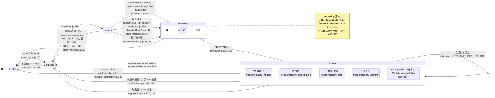
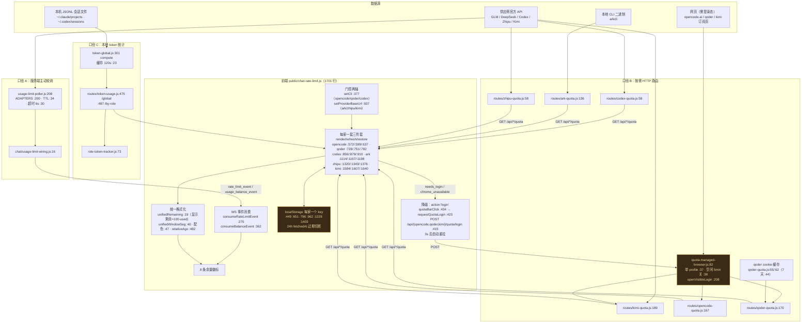

# 架构梳理：会话状态机 + 余量查询链路

> 只读梳理，不含任何业务代码改动。所有节点标注 `文件路径:行号`。
> 生成于 2026-08-04，基于分支 `multicc/multicc-claude-chat-05`。

---

## 一、会话状态机

### 1.1 关键前提：这里不是一套状态，是四层折算

| 层 | 词汇 | 定义处 |
| --- | --- | --- |
| ① 调度器队列态 `queueState` | `idle / starting / running / assessing / frozen` | `src/session-work-scheduler.js:9`（`ACTIVE_STATES`） |
| ② 冻结原因 `queueFreezeReason` | 16 个原因 → runState 的映射表 | `src/session-work-scheduler.js:22`（`FREEZE_REASON_RUN_STATE`）、兜底 `:46` |
| ③ classify 业务字母 | `P / D / W / B / E`（`C` 已退役） | `src/classify/vocab.js:75`（`CLASSIFY_DISPLAY`），C 退役注记 `:84` |
| ④ 展示态 presentation | `idle queued running waiting blocked error done cancelled archived offline unknown` | `public/status-presentation.js:60`（`STATUS_PRESENTATION`）、别名 `:124` |

中间层 `runState`（`queued/running/waiting/done/error/idle`，`src/task-board.js:28`）由
`getRunState()` **从 ①②③ 折算出来**：`src/session-work-host.js:160-177` —— 有 classify 字母时字母优先，
否则看 queueState，frozen 再查冻结原因表。

**业务状态的唯一写者是 classify 状态机**（`docs/cancel-state-flow.md` 定的规矩）：
`setTaskState(...)` 只在 `src/classify/state-machine.js:203 / :284 / :749 / :818` 被调用。
取消控制器只能停 runner + 提交结构化结果，**不许自己写状态**。

### 1.2 状态图

### 1.3 按模块分层

**入口层（不写状态）**
- HTTP / WS 入口：`src/routes/orchestration.js:29`（`/api/sessions/:id/queue` `:238`、`queue/action` `:249`，7 个 action，`:257` 强制 `confirm:true`）
- 聊天轮入口：`src/chat/turn-engine.js:577 admitChatWork` → `:586 runChatTurn` → `:1355 runChatTurnStreaming` → `:1520 finalizeStreamingTurn`

**调度层**
- FIFO 队列与冻结：`src/session-work-scheduler.js`，状态写点 `:535 starting`、`:621 assessing`、`:596/:655 frozen`，重启恢复 `:1039-:1136`
- 主机胶水：`src/session-work-host.js` —— `:160 getRunState`、`:192 isRunActive`、`:204 closeTurnForClassify`、`:346 onSchedulerEvent`、`:639 cancelActiveTurn`

**判定层（唯一写者）**
- `src/classify/state-machine.js` —— `:105 dispatchStateAction`（结构化直投，不过模型）、`:356 applyClassifyResult`、`:393 scanAndReclassify`（60s 周期扫描）、`:616 runClassifyNow`、`:704 classifyTurnEnd`
- 字母词表与解析：`src/classify/vocab.js:10 parseClassifyResult`（解析不出 → `W`，`:41-53`）、`:139 isTerminalLetter`（只有 D）、`:145 applyUserInputEvidence`（结构化工具证据强制 W）

**持久化 / 广播层**
- `src/routes/task-state-store.js:25 setTaskState`（写 `persisted.taskState` `:30`，broadcast `:43/:45`）
- ⚠️ 生产实际走的是 `server.js:2520` 的同名内联实现（见坏味道 #1）

**外部唤醒层**
- 外部等待：`src/wait-injector.js:145 register`、`:195 hasWait`、`:202 resolve`、`:229 tick`、`:287 autoContinue`、`:315 resumeInterrupted`、`:344 bgCheck`；服务封装 `src/wait-service.js:19`
- 触发器 / cron：`src/triggers/index.js:9 TRIGGER_TYPES`、`:170 fireTrigger`、`:224 firePostTurnTriggers`、`:311 buildCronTasks`、`:364 reconcileSession`
- 跨会话派活：`src/dispatch/gateway-host.js:308 dispatchToSession` → `:359 admitDispatch`（`idempotencyKey` `:362`）→ `:457 finalizeDispatch`

**并发与竞态保护**
- 单调序列 + 原子落盘：`src/orchestration-store.js:218 enqueue`（`:226 mutate` 串行化）、`:126 writeAtomic`（temp + `renameSync` `:148` + `fsyncDirectory` `:109`）
- 投递租约：`src/outbox.js:94 admitOutboxItem`（`sequence` `:125`）、`:232 claim`（`leaseToken` `:274`、只存 hash `:281`）、`:288 acknowledge`、`:306 fail`（`maxAttempts` → `dead-letter` `:204/:326`）、`:335 defer`（**目标忙不算失败**，回退 attempts `:349`）
- 取消幂等：`session-work-host.js:639` 按 sessionId 的幂等表；停进程 `SIGTERM → 1.5s → SIGKILL → 5s → 报失败`（失败仍记 `E` + `{ok:false, code:'runner_stop_timeout'}`）
- Git 串行：`src/repo-actor.js`（per-repo 队列，`:20 operationId`、`:34 repoKeyFor`）、`src/git-queue.js:13 queueDepth`；路由 `src/routes/session-git.js:553 merge` / `:577 sync` / `:621 rebase`，兄弟 worktree 自动同步 `:209 autoSyncSiblingWorktrees`，会话闸门 `:188 sessionSyncGate`

**异常兜底**
- 字母解析失败 → `W`（绝不误判 `D`）
- turn 没触发终端 `result` 事件 → `resumeInterrupted`（上限 10）
- 看门狗判死 → 走**同一条** cancel 通道，只是 `cancelSource` 不同（`process-watchdog.js:98-105`）
- 冻结原因未知 → 含 `error` 归 `error`，否则归 `waiting`（`scheduler.js:46`）

---

## 二、余量 / 额度查询链路

### 2.1 三套并存的口径（语义完全不同，UI 长得一样）

| 口径 | 数据来源 | 触发方式 | 入口 |
| --- | --- | --- | --- |
| **A 主动轮询** | 供应商官方 API（GLM monitor / DeepSeek balance / Codex usage） | 服务端定时，按策略 TTL | `src/usage-limit-poller.js:208` |
| **B 按需 HTTP** | 官方 API / 本地 CLI / 无头浏览器抓页 | 前端点击或切 provider 时拉 | 8 条 `/api/*/quota` 路由 |
| **C 本地统计** | 扫本机 JSONL 会话文件累加 token | 前端请求，120s 缓存 | `src/token-global.js:301` |

A 的适配器表 `src/usage-limit-poller.js:200 ADAPTERS`：`pollGlmMonitor:77`、`pollDeepseekBalance:111`、
`pollCodexUsage:153`；TTL 按策略 `:34`，超时 6s `:30`，key 只存 hash `:49`。
经 `src/chat/usage-limit-wiring.js:16` 转成两种 WS 事件：`rate_limit_event`（`:31`，窗口利用率）
和 `usage_balance_event`（`:40`，预付余额），前端在
`public/chat-rate-limit.js:275 consumeRateLimitEvent` / `:362 consumeBalanceEvent` 消费。

C 走 `src/token-global.js`：扫 `~/.claude/projects`（`:21`）+ `~/.codex/sessions`（`:22`），
缓存 120s（`:23`），codex rollout 分叉重放去重 `:207`；出口
`src/routes/token-usage.js:475 /api/token-usage/global`、`:487 /api/token-usage/by-role`；
按角色分摊 `src/role-token-tracker.js:73`，事件规范 `src/usage-observed.js:98`。

### 2.2 B 类六家的取数方式各不相同 —— 这是最大的口径差异点

| 供应商 | 怎么取的 | 关键行 | 独有状态词 |
| --- | --- | --- | --- |
| codex | 读 `~/.codex/auth.json` + 打官方 API | `src/routes/codex-quota.js:21`、`:58`、周窗口挑选 `:38` | `no_auth` |
| ark | **spawn 本地 arkcli 二进制**解析 stdout | `src/routes/ark-quota.js:50 resolveArkcliBin`、`:63 runArkcli`、`:136` | `needs_install`（配套 `POST /install` `:212`） |
| zhipu | 直接 HTTP 打站点，多站点聚合 `sites[]` | `src/routes/zhipu-quota.js:41 collectZhipuTargets`、`:58` | `not_configured` |
| kimi | HTTP 余额，失败**回落 CDP 抓订阅页** | `src/routes/kimi-quota.js:79 fetchKimiBalance`、`:139 fetchKimiSubscriptionPage`、`:189` | `needs_login` + `source:'subscription-page'` |
| opencode | **纯 CDP**，从页面 HTML 的 script 字面量里正则抠数 | `src/routes/opencode-quota.js:56 parseUsage`、`:95`、`:167` | `chrome_unavailable` |
| qoder | 先用**磁盘 cookie 直连 API**，失败再 CDP 抓包 | `src/routes/qoder-quota.js:62 loadSavedCookies`、`:119`、`:143 fetchViaPage` | cookie 7 天过期 `:44` |

三家 CDP 抓取共享一个托管浏览器：`src/quota-managed-browser.js:82 createManagedQuotaBrowser`，
**独立 profile** `:37`，空闲 5 分钟自动关 `:38`，
`:208 openVisibleLogin`（**必须先停掉 headless，同一 profile 不能双开**）。

另有一条独立的余额面：`src/routes/provider-balance.js:43 createProviderBalanceRuntime`，
出口 `:92 /api/providers/balances`、`:99 /api/providers/:appType/:id/balance`（管理页 `public/manage-provider-balance.js`）。

### 2.3 链路图

### 2.4 刷新与失效策略

- **前端错误退避**：每家一个 `*_QUOTA_BACKOFF_MS = 60_000`（`:446 :648 :793 :925 :1213 :1389`），
  出错后 60s 内不再自动重拉；`refresh*(force=true)` 可穿透。
- **在途去重**：每家一个 `*FetchInFlight` 标志，避免并发重复请求。
- **本地缓存**：`localStorage` + `fetchedAt` 24 小时过期，页面加载先 `restore*()` 显示旧值再异步刷新。
- **服务端缓存**：轮询侧按策略 TTL（`usage-limit-poller.js:34`）；token 统计 120s（`token-global.js:23`）；
  qoder cookie 7 天（`qoder-quota.js:44`）；ark 二进制路径解析结果只缓存成功值（`ark-quota.js:51`）。
- **失败降级**：`needs_login` / `chrome_unavailable` 渲染成可点击的登录入口；其余失败退回上一次缓存值 +
  相对时间戳（`kimiCachedView :1458` 是这套的样板），彻底无数据时才显示错误文案。

---

## 三、现状里值得注意的问题（只诊断，未改动）

### 3.1 状态机

1. **`task-state-store.js` 是没上线的复制品，而且已经漂移。**
   `src/routes/task-state-store.js` 全仓库只被 `tests/test-cancel-state-flow.js:28` 引用，
   生产走的是 `server.js:2520` 的内联同名实现。两份已经不一致：server 版会自动打
   `classifyUpdatedAt`（`:2524-2530`）但 defaults 缺 `cancelSource`/`cancelOperationId`、
   广播 payload（`:2537-2543`）**不带取消信封**；模块版有完整取消信封但没有 `classifyUpdatedAt`。
   结果是 **测试测的是没跑在生产上的那份代码**。

2. **状态词汇要过四层折算，加一个状态得改四张表。**
   `queueState`（`scheduler.js:9`）→ `freezeReason`（`scheduler.js:22`）→ `runState`
   （`session-work-host.js:160`）→ presentation（`status-presentation.js:60` + 别名 `:124`），
   再加 classify 字母表（`vocab.js:75`）和两份 i18n 文案。任何新状态都是六处齐改，漏一处就掉进 `unknown`。

3. **`cancelled` 是纯展示态，靠取消信封字段反推 —— 而信封字段正好是第 1 条漂移掉的那几个。**
   服务端没有 `cancelled` 字母（用户停止 = `E` + `cancelledAt/cancelReason/cancelSource/cancelOperationId`）。
   一旦生产广播不带这些字段，前端就只能显示成 `error` 而不是 `cancelled`。

4. **`isRunActive()` 对 `assessing` 的挖洞是承重的隐式约定。**
   `src/session-work-host.js:195` 明确让 `assessing` 返回 `false`（进程还活着但不算"在跑"）。
   这个语义只写在注释里，任何新写的"是否在跑"判断只要不复用这个函数，就会在判定窗口期算错。

5. **两条自动恢复上限互不知情。**
   `wait-injector.js:86 MAX_RESUME_INTERRUPTED = 10` 和 `outbox.js:204 maxAttempts → dead-letter`
   是两个独立计数器。同一件工作若既走 outbox 投递又触发中断恢复，实际重试次数是两者的乘积量级，
   没有跨机制的全局收敛保证。

### 3.2 余量查询

1. **三套语义完全不同的口径，渲染成同一排同形状的徽标。**
   A（官方窗口利用率）、B（账户余额 / 订阅额度）、C（本机 JSONL 累计 token）在 UI 上无法区分。
   用户看到"还剩 77%"时，没有任何线索判断这是官方口径还是 multicc 自己数出来的。

2. **六份 quota 路由 + 六份前端三件套是复制粘贴同构。**
   backoff 常数、storage key、`*FetchInFlight`、`*LastErrorAt`、`restore*` 各写六遍，
   `public/chat-rate-limit.js` 1701 行里绝大部分是这种重复。任何策略调整要改六处，
   **本轮修的 kimi 渲染优先级 bug 就是"只改了其中几处"的产物**。

3. **失败状态词有七个且语义重叠。**
   `needs_login` / `needs_auth` / `no_auth` / `needs_install` / `not_configured` /
   `chrome_unavailable` / `unavailable` 分散在六个模块里，前三个基本是一件事。
   前端只能逐 kind 手写映射，漏一个就掉进兜底文案（这正是 kimi 那个 bug 的形态）。

4. **kimi 的 `chrome_unavailable` 前端分支当前不可达。**
   `src/routes/kimi-quota.js` 把抓取层的 `chrome_unavailable` 收敛成了 `status:'unavailable'`，
   并被 `tests/test-kimi-quota.js:233-242` pin 住（另一个会话的既定决策）。
   前端 `chat-rate-limit.js:1509` 那段因此是死分支 —— 是待办，不是已修。

5. **托管浏览器是单点串行资源，且没有排队可见性。**
   单 profile（`quota-managed-browser.js:37`），同一时刻只能一个持有者；
   `openVisibleLogin:208` 还会先把 headless 实例停掉。opencode / qoder / kimi 三家同时刷新时
   互相排队甚至互踢，前端只看到"某一条一直转圈"，没有任何队列深度或占用者的提示。
