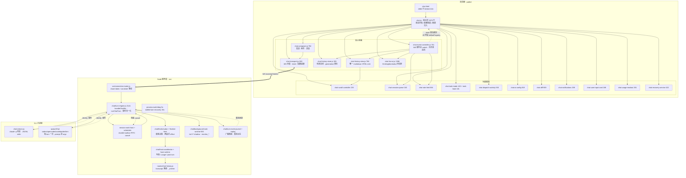
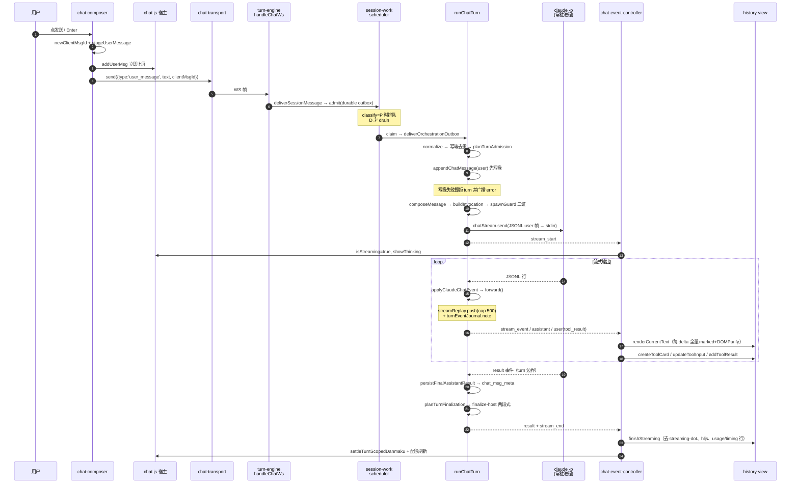
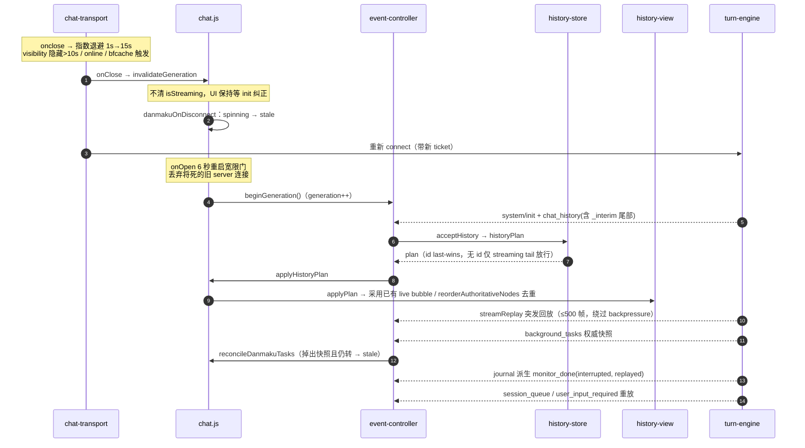
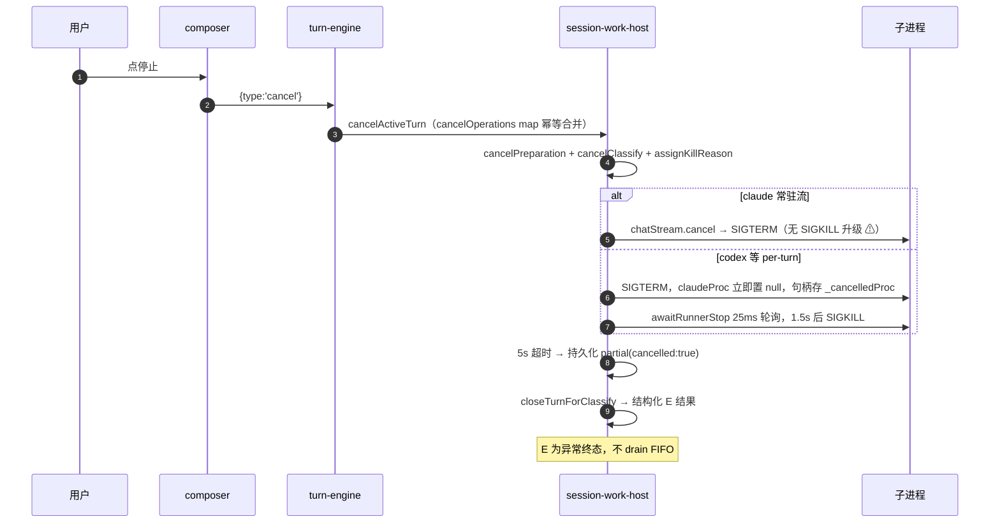

# Chat 页面代码架构 Review（2026-08-20）

对 `public/chat*.js`（前端 ~15.5k 行）+ `src/chat/**` + `server.js` chat 管线（服务端 ~9.2k 行）的一次全量走读。
本文只描述**现状**，不含改造实施。行号基于本次 review 时的 worktree。

---

## 一、总体分层

```
浏览器                                     Node 服务端                       CLI 子进程
────────────────────────────────────────────────────────────────────────────────────
chat.html                          server.js (组装/广播漏斗)
  └ chat.js  ← 宿主/胶水层            └ src/ws/connection-router.js  ← 鉴权
      ├ chat-transport      WS ─────→   └ src/chat/turn-engine.js    ← WS handler
      ├ chat-event-controller ←───────      ├ src/session-work-*     ← 队列/串行
      ├ chat-history-store/view              ├ src/chat/finalize-*   ← 收尾状态机
      ├ chat-live-ui                         ├ src/chat/host-*       ← 持久化协调
      ├ chat-composer                        └ src/chat-stream.js  ──→ claude -p (常驻)
      └ 其余 ~15 个功能模块                       spawnChat        ──→ codex/opencode/… (每 turn)
```

关键结论：**chat.js 已经是纯宿主层**，2973 行里几乎没有业务逻辑，全部是「创建模块 + 注入回调 + 持有状态」。
真正的分发逻辑在 `chat-event-controller.js`，真正的 DOM 在 `chat-history-view.js` / `chat-live-ui.js`。

---

## 二、代码结构图（Mermaid）



### 前端模块职责速查

| 模块 | 行数 | 职责 | 关键入口 |
|---|---|---|---|
| chat.js | 2973 | 宿主：状态 + 组装 + 30+ 回调注入 | 启动点 L2799-2801 |
| chat-event-controller.js | 701 | 34 种 WS type 的总 switch、流式状态机 | `handleEvent` L225 |
| chat-live-ui.js | 1386 | thinking / danmaku / API 错误条 / 对话框 | `pushDanmaku` L724 |
| chat-history-view.js | 786 | 全部消息 DOM，唯一 markdown sink | `applyPlan` L616 |
| chat-composer.js | 784 | 发送 / 附件 / 录音 / 流式语音 | `send` L82 |
| chat-history-store.js | 265 | 纯状态机（无 DOM/网络/定时器） | `historyPlan` L71 |
| chat-transport.js | 269 | WS 连接 · ticket 校验 · 退避重连 | `connect` L102 |

### 服务端模块职责速查

| 模块 | 行数 | 职责 |
|---|---|---|
| turn-engine.js | 2141 | WS handler + runChatTurn + 事件归一化，总装 |
| transcript-prune.js | 919 | claude resume 前的转录裁剪 |
| api-error-policy.js | 690 | API 错误分类 / 重试决策 |
| background-task-runtime.js | 593 | 后台任务 tail shadow + monitor_* 广播 |
| host-coordinator.js | 586 | 写盘 / usage / post-turn 的纯协调 |
| finalize-plan.js | 393 | 收尾决策：continue-codex / retry-* / finalize |
| turn-request.js | 318 | 入站归一化 + admission + spawn 三证 |

---

## 三、时序图 1：一次正常对话（claude 路径）



## 时序图 2：断线重连与对账



## 时序图 3：取消（interrupt）



---

## 四、设计亮点（值得保留的约束）

1. **双层 generation 防串代**：transport 的 `connectGeneration` + controller 的 `generation/isOwned`，旧 socket 的迟到事件一律丢弃。
2. **重复气泡六道防线**：controller 层文本快照比对 + codex 尾重去重、view 层 commitMessage 三种采用路径 + contained 去重、applyPlan 三种采用 + reorderAuthoritativeNodes、store 层 id last-wins / 无 id 丢弃。
3. **写盘是 turn 的准入前提**：user 消息 append 失败直接拒 turn，不会出现「跑了但历史里没有」。
4. **spawn 三证**：durable-message + provider-route + runtime-claim 全齐才允许起子进程。
5. **danmaku 的 confirmedBg 机制**：以服务端 `background_tasks` 快照为权威，抵御 monitor_done 丢失。
6. **history-store 是纯函数状态机**：无 DOM / 无网络 / 无定时器，可独立单测。
7. **XSS 面收敛到一处**：`chat-history-view.js:137` 是全页唯一 markdown HTML sink，上游 safe-markdown 是 fail-closed 的 marked+DOMPurify。

---

## 五、发现的问题（按严重度）

### 高

| # | 位置 | 问题 |
|---|---|---|
| H1 | `src/chat-stream.js:477-484` | **cancel 路径无 SIGKILL 升级 → 子进程泄漏**。`cancel()` 只发 SIGTERM，`close()` 才有升级；`session-work-host.js:534-541 forceKillRunner` 只杀 `_cancelledProc`，常驻 stream proc 不在其中。忽略 SIGTERM 的 claude 进程会永远活着，后续 turn 继续复用这个 wedged 进程（pump 只查 isAlive）。 |

### 中

| # | 位置 | 问题 |
|---|---|---|
| M1 | `chat-event-controller.js:507-510` → `chat-history-view.js:144-152` | **流式 markdown 无节流，长消息 O(n²)**。每个 text_delta 都对全量累计文本重跑 marked.parse + DOMPurify.sanitize。50KB 回复 = 数百次全量解析，移动端明显卡顿。建议 rAF 合帧或 ~50ms 节流，final 保持同步。 |
| M2 | `session-work-host.js:591` + `turn-engine.js:1299-1303` | **per-turn 路径 cancel 后前端收不到 `stream_end`**。`claudeProc` 先置 null → close handler 判为 stale proc 直接 return → finalize 整段跳过。前端直播 spinner 只能靠 classify E 兜底，可能残留到重连。 |
| M3 | `turn-engine.js:2103` + `692-693` | **用户消息可能静默丢失**。`pendingMemory.finally(deliver)` 不 await（reject 变 unhandled）；`admitChatWork` 返回 `{ok:false, scheduler_not_ready}` 时 WS handler 完全忽略返回值，前端零反馈。 |
| M4 | `turn-engine.js:1984-1989` | **重连 replay 清共享 buffer 竞态**。任一客户端 connect 就清空全 session 共享的 `cs.streamReplay`，第二个客户端会丢失中间未持久化的 tool 帧。 |
| M5 | `turn-engine.js:1236/1258/1305`、`chat-stream.js:145/153` | **JSONL 解析错误静默吞**。adapter 输出一行坏 JSON 即永久丢事件，无日志无计数。 |
| M6 | `chat.js:327-328 / 2512`、`chat-event-controller.js:355` | **stagedUserBubbles 只写不读 + 无界增长**。全前端无任何读取渲染点，删除仅在 task 模式发送失败时；session 模式每条消息一个条目（含完整文本）永不清理。 |
| M7 | `chat.js:2055/2065/2264` | **原生 `prompt()/confirm()/alert()`**。与同文件 L664-667 的注释（"native confirm 在 WebView 常被抑制所以自建 _chatConfirm"）自相矛盾；Android WebView 里这些按钮表现为点了没反应。 |
| M8 | `chat.js:1619` 等大量 `catch (_) {}` | **静默吞错**。`loadSessionModel` 的 catch 包住 20+ 个 UI 更新调用，任一抛错后续全跳过——注释自己承认这是历史事故点。 |
| M9 | `chat-event-controller.js:355` | **模块内裸引用 `window`**。IIFE 参数名是 `global`，此处直接用 `window`，Node 侧走到该分支即 ReferenceError（目前测试没覆盖到）。 |

### 低（摘要）

- `chat-event-controller.js:579` 短块（<16 字）去重盲区，codex 可能二次追加。
- `chat-event-controller.js:503/599/635/647` `currentMsgEl` 未判空，乱序帧会 TypeError。
- `chat.js:185-209 fixupLocalImages` 每次流式重渲染都重复 addEventListener（click 未去重）。
- `chat.js:2901/2967` 浏览器里调 `timer.unref()`（死代码）；banner 30s 轮询不判 `document.hidden`。
- `chat.js:133-135 withToken()` 是空操作但有 60+ 调用点。
- `chat.js:390` `applyCliUi` 直接覆写 `document.title`，与 `_baseTitle` 两套标题源。
- `chat-live-ui.js:894/901` `startTitleAnimation` 绕过注入的定时器，测试替身管不住。
- `chat-recovery-service.js:73-82` 长按 600ms 定时器缺 blur 兜底，alt-tab 会误触发 reload。
- `turn-event-journal.js:139/162` 遇坏行 `break`，单行损坏后该文件后续事件全部退出 replay。
- `turn-engine.js:1253/1269` per-turn 行缓冲 `lineBuf`/`stderrPending` 无上限。
- `post-turn-router.js:34` 的 `ack-handoff` effect 在 `host-runtime.js:260` 会 throw（当前不可达，但 `reservePostTurn` 已传 handoff，一旦启用会中断 effect 循环使 dispatch 挂死）。
- 后台任务 tail shadow 泄漏窗口最长 2h（有 idleMaxHoldMs 兜底但很长）。

### 对账机制现状

**有**：重连全量 chat_history（含 `_interim` 提升）、streamReplay ≤500 帧突发回放、`background_tasks` 权威快照、journal 派生 `monitor_done(interrupted)`、session_queue/user_input 重放、`chat_msg_meta` 携带完整消息。

**无**：WS 帧无 seq/ack，客户端无 gap 检测与选择性重传；`diffToolTiming` 对账腿只在测试里跑，未在线运行。

---

## 六、如果要动手，建议顺序

1. **H1**（子进程泄漏）：cancel 超时后对 `s.proc` 升级 SIGKILL —— 改动小、收益直接。
2. **M1**（流式渲染节流）：rAF 合帧，final 保持同步 —— 用户可感知的性能提升。
3. **M2 / M3**（stream_end 缺失、消息静默丢失）：都是"UI 卡在中间态"类问题，前端零反馈最伤体验。
4. **M6**（stagedUserBubbles）：先确认是否还有设计意图，没有就删干净，别留半截状态。
