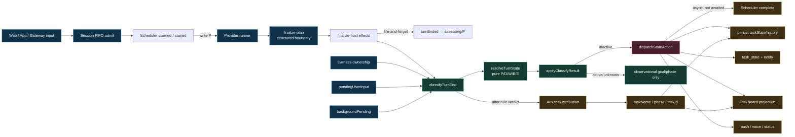
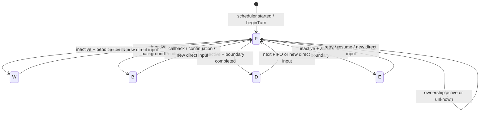
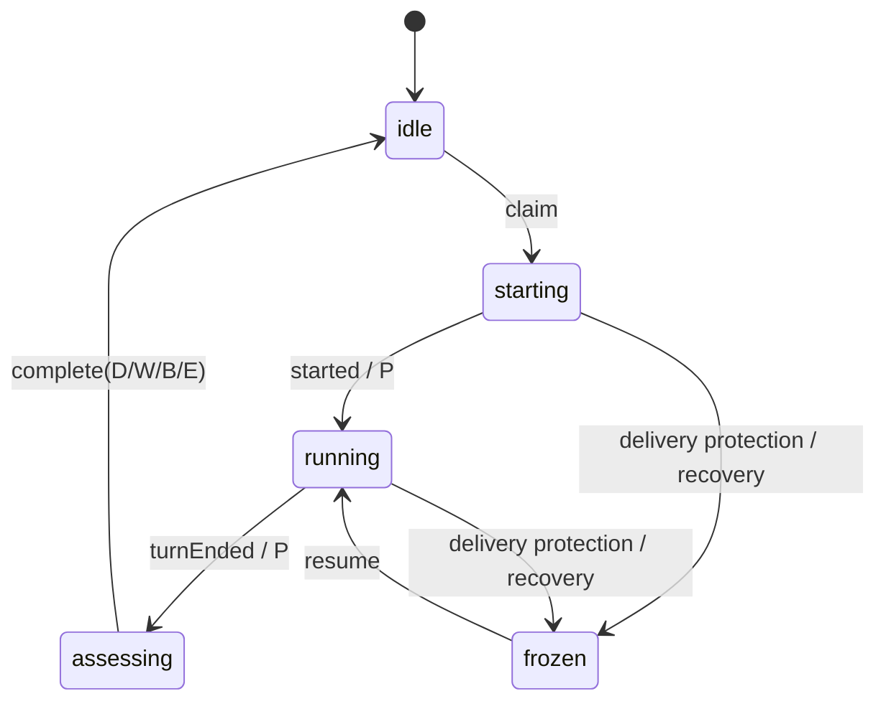
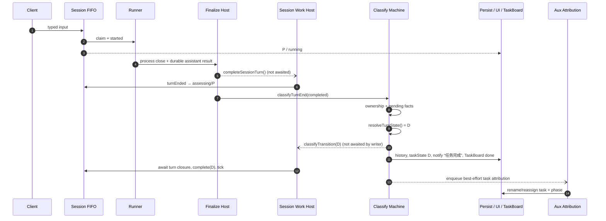
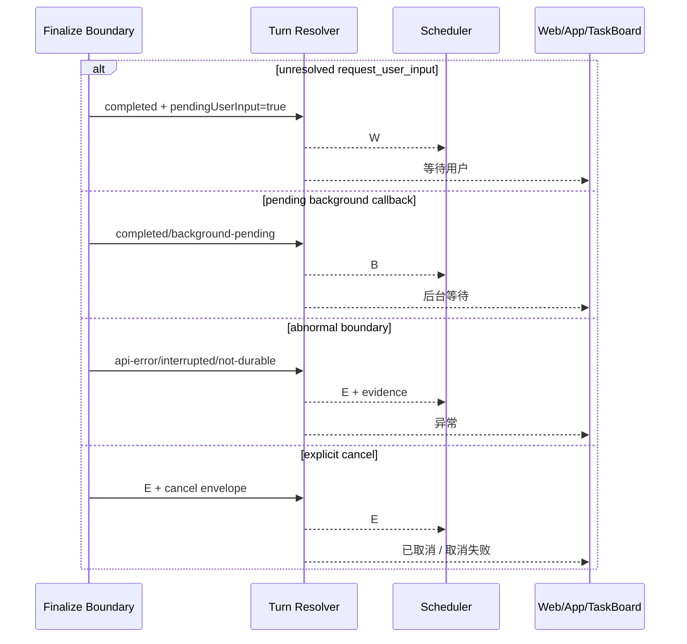
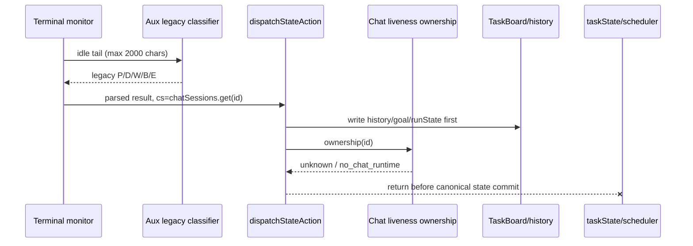
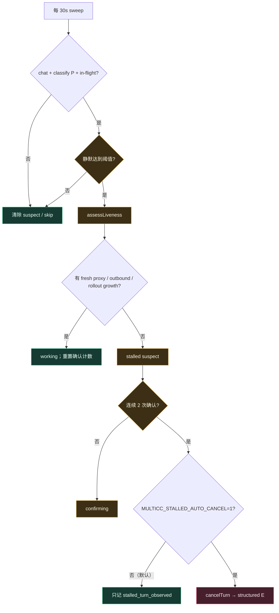
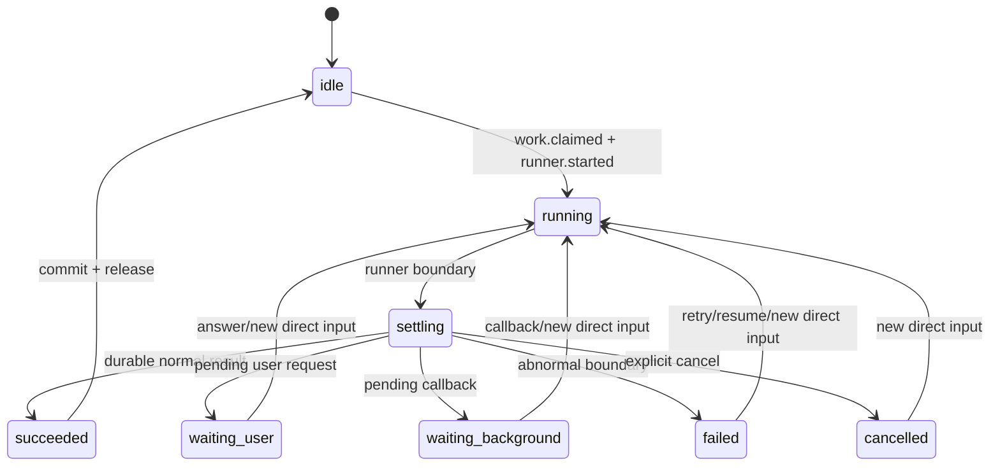
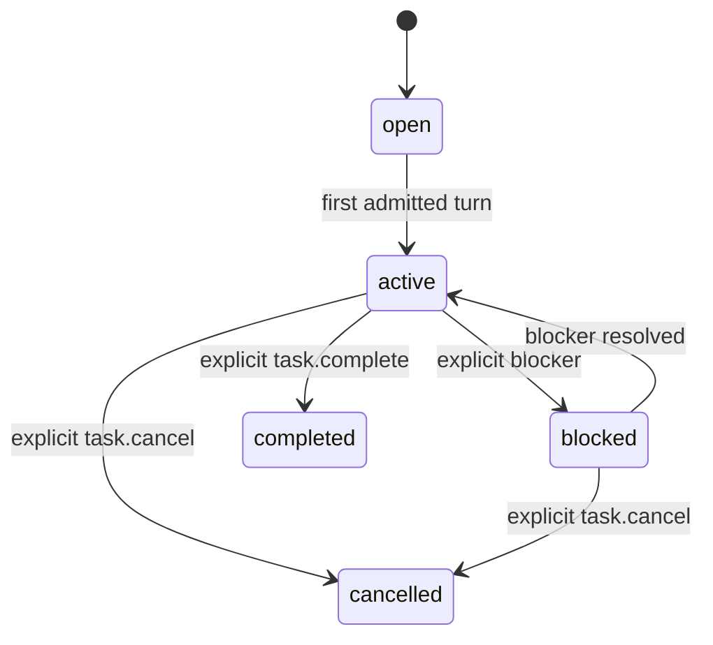
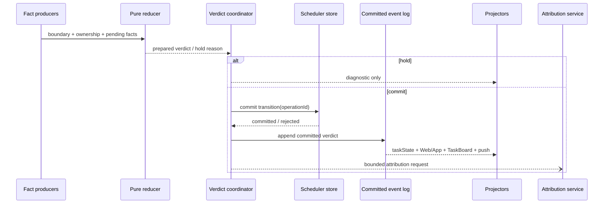

# Classify 状态机：现状、时序与审计

> 审计日期：2026-08-15  
> 代码基线：`92b3776`  
> 范围：Chat / Terminal 的 turn 收尾、P/D/W/B/E 状态、Session FIFO、任务看板、Aux 任务归集、静默卡住检测。  
> 可视化版：运行中的 MultiCC 服务上访问 `/docs/classify-state-machine-architecture`（例如 <http://127.0.0.1:3000/docs/classify-state-machine-architecture>），源文件 `public/docs/classify-state-machine-architecture.html`。

## 结论先行

当前 Chat 主路径已经不再让模型决定运行状态：`resolveTurnState()` 根据结构化事实产生 P/D/W/B/E，Aux 只负责任务命名和归集。这一方向正确，也已经切断“摘要/归集模型故障导致 turn 永远卡在 P”的旧耦合。

但它还不是一个语义闭合、单写者、原子提交的状态机，核心问题有五个：

1. **`D` 的证据只是“本轮结果正常持久化并结束”，却被 UI 和任务看板解释成“整项任务完成”。** 这是当前最高优先级的语义错误。
2. **状态、调度、任务看板和通知不是一次原子提交。** `dispatchStateAction()` 先写历史和任务看板，再检查 liveness；随后又异步触发 scheduler transition，但不等待就写 task state、推送和广播。
3. **Terminal 仍走旧模型分类器，而且复用了 Chat 专用 liveness。** Terminal 没有 `chatSessions` runtime，ownership 返回 `unknown/no_chat_runtime`，使 D/W/E 候选被挡住。
4. **Aux 的 prompt 无字符/token 上限，失败后的扫描节流又没有自己的成功/尝试时间戳。** 一个长会话可以构造约 20 万字符的归集 prompt，失败时还可能每分钟重试。
5. **“classify”同时承担 turn outcome、任务命名、phase、显示映射和调度副作用。** 文件名像一个模块，实际是多个状态域叠在一起。

静默误杀已单独加固：静默只形成怀疑，默认只观察不自动取消；真正的自动取消只有在显式设置 `MULTICC_STALLED_AUTO_CANCEL=1` 后才生效。见[第六节](#六静默卡住判断当前实现)。

## 一、当前输入与输出

### 1.1 确定性 turn 判定输入

`src/classify/turn-state.js` 的纯函数输入如下：

| 输入 | 来源 | 取值 | 用途 |
|---|---|---|---|
| `liveness.state` | `livenessRuntime.ownership()` | `active / inactive / unknown` | 判断 close 候选是否允许提交 |
| `boundary` | `finalize-plan` | `completed / api-error / interrupted / unknown-interruption / result-not-durable / handoff-resume-failed / background-pending` | 本轮结束事实 |
| `pendingUserInput` | `userInputSignalHost.pending()` | boolean | 是否有结构化待用户问题 |
| `backgroundPending` | background runtime | boolean | 是否仍有后台结果待回流 |
| `sessionType` | persisted session | chat / gateway 等 | 只影响 evidence 文案 |

优先级写死在 [`turn-state.js`](../src/classify/turn-state.js)：

```text
active / unknown liveness
        > pending user input
        > pending background
        > completed boundary
        > abnormal boundary
        > unknown boundary
```

### 1.2 当前输出字母

| 字母 | resolver 的实际证据 | scheduler 行为 | 当前 UI / TaskBoard 文案 | 审计判断 |
|---|---|---|---|---|
| `P` | runner active，或 ownership unknown | 不放行旧 FIFO | 处理中 / running | 基本一致；unknown 与 active 被合并，诊断信息靠 evidence 才能区分 |
| `D` | `boundary === completed` | 释放 active，普通 FIFO 可继续 | 任务已完成 / done | **不一致：这里只证明 turn succeeded，不证明 task completed** |
| `W` | 有未解决的结构化用户问题 | 释放 active，等待 answer/新 direct input | 等待用户 | 一致 |
| `B` | 有后台结果待回流 | 释放 active，等待 callback/continuation | 后台等待 | 基本一致 |
| `E` | API/中断/未持久化/取消 | 释放 active，等待 retry/resume/新 direct input | API 异常；取消时由 envelope 修正文案 | 字母过载，必须始终携带 reason/kind |

### 1.3 实际输出消费者

一次 verdict 目前会影响：

- Session FIFO：`session-work-host.classifyTransition()` → `session-work-scheduler.complete()`；
- persisted `taskState`、`classifyHistory`、session status；
- Web/App 的 `task_state` 与 `notify` WebSocket 事件；
- push / voice / ding；
- TaskBoard `runState`；
- 60 秒 Aux 命名扫描是否继续尝试。

这些输出没有共同的 durable operation id，也没有一次性 commit boundary。

## 二、当前大图



关键事实：**规则判定和 Aux 已经分离，但规则提交和所有投影还没有分离。**

## 三、当前状态机

### 3.1 Chat turn 状态机



这里的 `D` 是 **turn terminal**，不是可靠的 **task terminal**。证据来自 [`finalize-plan.js`](../src/chat/finalize-plan.js)：只要正常结果已持久化，plan 就发出 `classification: completed`；它没有检查整个用户目标是否完成。

### 3.2 Scheduler 内部状态



注意：正常运行时，W/B/E 都会释放 active slot 并回到 `idle`；它们只是通过 `classifyState` 阻止旧普通 FIFO 自动前进。恢复路径却可能为持久化的非 D 状态重建一个 `legacy-active + frozen`，因此 live 与 recovery 的内部形态不同。

## 四、输入输出时序

### 4.1 正常 Chat turn



风险窗口：步骤 10 的投影可能先于步骤 11 的 scheduler durable transition 完成。取消路径会等待 `pendingTransitions`，普通 D/W/B/E 路径不会。

### 4.2 等用户 / 后台 / 异常



取消已经携带 `cancelledAt` 和 `cancelReason`，`task_state` 也会广播这两个字段；因此 E 可以在展示层区分“提供方异常”和“用户取消”。问题在于字母本身仍不足以表达原因，任何只看 E 的消费者仍会误标。

### 4.3 Terminal 旧路径



这不是理论问题：Terminal session 不在 `chatSessions` 中，当前调用点见 [`push-runtime.js`](../src/push-runtime.js) 133–168 行；Chat ownership 对没有 runtime 的 session 明确返回 `unknown/no_chat_runtime`。结果是日志可以显示“Terminal classify D”，任务看板可能已经写成 done，但持久化 classifyState 仍停在 P。

## 五、代码结构图

### 5.1 当前结构

```text
src/classify/
├── turn-state.js             纯规则：facts -> P/D/W/B/E
├── state-machine.js          1000+ 行：
│   ├── liveness gate
│   ├── verdict side effects / scheduler bridge
│   ├── 60s scan
│   ├── Aux task attribution orchestration
│   ├── task identity mutation
│   └── turn lifecycle helpers
├── task-attribution.js       Aux prompt + JSON parser + recent task context
├── vocab.js                  旧模型状态 parser + display + phase + legacy prompt
└── user-input-host.js        pending question evidence

src/chat/
├── finalize-plan.js          结构化 boundary
├── finalize-host.js          执行 effect；turnEnded 是 fire-and-forget
├── stalled-turn-recovery.js  静默卡住观察/可选恢复
└── process-watchdog.js       正证据：runner 已死

src/
├── liveness/runtime.js       ownership 与 working/stalled/idle
├── session-work-host.js      verdict -> scheduler transition
├── session-work-scheduler.js FIFO / active slot / recovery
├── push-runtime.js           Terminal 旧模型 classifier
├── task-context-host.js      classify letter -> TaskBoard runState
└── routes/task-state-store.js persisted task_state + WS projection
```

### 5.2 主要职责交叉

| 关注点 | 当前所有者 | 交叉点 |
|---|---|---|
| turn outcome | `turn-state.js` | Terminal 仍由 `vocab.js` 模型输出 |
| commit guard | `state-machine.js` + `liveness/runtime.js` | guard 前已有 history/TaskBoard 写入 |
| scheduler commit | `session-work-host.js` | 调用方通常不 await |
| task lifecycle | TaskBoard | 从 turn letter 直接派生，D 自动变 done |
| task identity/phase | Aux | 和 turn state orchestration 同处 `state-machine.js` |
| presentation | server vocab + Web registry + App helpers | E、phase、legacy C 仍有多份映射 |

## 六、静默卡住判断（当前实现）

静默恢复不属于 classify verdict，它是 liveness 的运维保护层。当前路径如下：



默认参数：

| 参数 | 值 | 说明 |
|---|---:|---|
| sweep interval | 30 秒 | 重新检查 |
| stall silence | 180 秒 | 复用 liveness 标准，不另造阈值 |
| starting grace | +120 秒 | spawn/MCP handshake/首 token 更慢 |
| confirmations | 2 次 | 在静默阈值之外还要连续确认 |
| cooldown | 120 秒 | 避免重复报告/恢复 |
| auto cancel | 默认 `false` | 只有环境变量显式设为 `1` 才杀 |

这次加固后的安全不变量是：

- “没输出”永远不是终止事实；
- 没有网络/rollout 活动仍只是负证据；
- 默认只观察；
- dead child / 当前 turn 相关 provider error 等正证据由独立 watchdog 处理；
- classify 不读取 silence 来决定 D/W/E。

## 七、审计发现

### P0 — `D` 把 turn 成功误当成 task 完成

**证据**

- `finalize-plan` 在正常 durable result 后固定产生 `classification: completed`；
- `turn-state` 把 completed boundary 固定映射为 D；
- `classifyTurnEnd` 又把 D 的 phase 固定改为 `done`；
- `dispatchStateAction` 发“任务完成”，TaskBoard 把 D 映射为 `runState=done`。

**影响**

任何“阶段性完成一轮，但用户目标还有后续步骤”的场景都会被错误关闭。规则化之后，系统不再有旧模型曾尝试提供的“整个任务是否完成”证据，却保留了旧字母的任务级文案。

**建议**

把 scheduler 的 D 重命名/重新定义为 `TURN_SUCCEEDED`（兼容期仍可传 D），展示为“本轮完成/空闲”；TaskBoard 的 `done` 必须来自独立、显式的 `task.complete` 事件或用户操作。

### P1 — commit guard 后置，存在部分提交

`dispatchStateAction()` 在 liveness guard 之前已经：

- append `classifyHistory`；
- 更新 goal/phase；
- 调用 `recordTaskBoardGoal(..., state)`。

随后才在 active/unknown 时 return。Chat 主路径外层通常会先挡住，但 Terminal 是直接调用者，因此会产生 TaskBoard=done、taskState=P 的分裂状态。

**建议**：把 guard 变成纯 `prepareVerdict()` 的返回值；只有 `commit=true` 才进入任何写操作。

### P1 — scheduler 与 projection 非原子

`dispatchStateAction()` 不等待 `classifyTransition()`，立即写 task state、广播和推送。普通路径可能出现：

```text
UI = D / done
scheduler = assessing / P
```

如果 scheduler 最终返回 `stale_classification` 或持久化失败，投影不会自动回滚。取消路径专门等待了 `pendingTransitions`，恰好证明普通路径也需要一个统一 await/commit boundary。

**建议**：Coordinator 生成 `verdictOperationId`，await scheduler commit 成功后再由同一 committed event 驱动持久化与各投影；失败则保持 assessing/P 并发布诊断，不发布业务终态。

### P1 — Terminal 分类器复用 Chat ownership，结果被永久 hold

Terminal idle classifier 仍调用旧 Aux 状态模型，随后把不存在的 `chatSessions.get(sessionId)` 传给 `dispatchStateAction()`。ownership 对此返回 unknown，非 P 候选不能提交。

**建议**：Terminal 需要自己的结构化 boundary/ownership adapter；在完成迁移前至少让 Terminal dispatch 使用 terminal process/monitor liveness，不能调用 Chat ownership。

### P1 — Aux prompt 无上限且失败可周期性重试

`buildTaskAttributionConversation()` 取最近 20 条 user/assistant 消息，但每条完整拼接，无字符/token 上限。实测 20 条各 10,000 字符会构造约 200,104 字符 prompt。

60 秒 scan 的 throttle 使用 `classifyHistory.at`，而 Aux attribution 本身不更新这个时间。目标仍为“新任务”且归集失败时，超过 2 分钟后可每轮重新 enqueue；dedup 只能阻止并发，不能阻止连续重试。

**建议**：

- 每条截断 + 总字符/token budget，例如 8–16k 字符；
- 优先保留最近 user、最近 assistant、任务 ID 和摘要；
- 写 `lastAttributionAttemptAt/resultAt/promptHash`；
- 对同一 prompt hash 指数退避；
- 成功命名后停止 scan，失败也有上限。

### P2 — “唯一写者”不成立

P 至少由 scheduler `started/turnEnded`、turn begin、Terminal output restart 等路径直接写入。D/W/B/E 主要经过 dispatch，但 Terminal 仍是旧直连。注释宣称 classify 是唯一语义 gate，实际是多个 writer 加一个共享字母。

**建议**：所有 transition 都进入 reducer/coordinator；其他模块只能发布 fact/event，不能直接写字母。

### P2 — live 与 recovery 的 scheduler shape 不一致

正常 W/B/E 会释放 active slot，schedule 回到 idle；冷启动恢复却可能为持久化非 D 创建 `legacy-active` 并标成 frozen。相同业务状态在重启前后拥有不同内部形状，旧文档还描述 W/B/E/P 都会 freeze。

**建议**：恢复只恢复事实，不制造虚假的 active task；没有 durable active delivery 时统一恢复为 idle + classify gate。

### P2 — `P` 在 turn-end 被静默降级为 `W`

`session-work-host` 把 D/E/B 之外的结果都变成 W，注释明确包含“P-misjudged-at-turn-end”。非法 transition 被隐藏成合法等待，增加排障困难。

**建议**：turn-end 收到 P 应返回 `invalid_transition` 并保持 assessing/P，由 coordinator 记录诊断；不得改写成 W。

### P2 — `E` 过载，reason 不是强制契约

E 同时表示 provider/API fault、interrupted、result not durable、manual cancel、watchdog cancel。当前 cancel envelope 已经广播，这是进步；但其他 E 分支并没有统一、结构化的 `kind/code/retryability`。

**建议**：保留兼容字母时，强制 `reason.kind`：`provider_error | interrupted | persistence_error | cancelled`，所有 UI 只通过 projector 渲染。

### P3 — 遗留代码与展示漂移

- `vocab.js` 仍包含旧三行模型状态 prompt、legacy C 和状态 parser；
- App phase switch 未覆盖 canonical `implementing`、`wrapping`；
- `dispatchStateAction` 的 D 分支仍写着“task genuinely finished”；
- `classifyUnavailable()` 已无生产调用但保留旧语义注释；
- 多份旧架构文档仍把 scan 描述为状态重判、把 W/B/E 描述为 freeze。

这些不一定立即破坏数据，但会让下一次修改沿着错误模型继续扩散。

## 八、建议的目标状态机

### 8.1 把两个状态域拆开

#### TurnExecution（调度事实）



#### TaskLifecycle（产品任务事实）



两者的关键不变量：

```text
turn.succeeded  ≠  task.completed
```

### 8.2 兼容期字母映射

| 旧字母 | 新 TurnExecution | 新展示 | TaskLifecycle 副作用 |
|---|---|---|---|
| P | running / settling | 处理中 | active（不自动变更） |
| D | succeeded | 本轮完成 / 空闲 | **无** |
| W | waiting_user | 等待用户 | 可选 blocked(reason=user) |
| B | waiting_background | 等待后台 | 可选 blocked(reason=background) |
| E | failed/cancelled，由 reason 区分 | 异常或已取消 | 不自动 completed |

### 8.3 目标提交时序



只有 `committed verdict` 可以驱动业务投影。Aux 失败、liveness unknown、scheduler reject 都只能产生 diagnostic，不得写 D/W/B/E 投影。

## 九、建议代码结构

```text
src/turn-lifecycle/
├── facts.js                  规范化 boundary / ownership / pending facts
├── reducer.js                纯函数 + exhaustive transition table
├── coordinator.js            prepare → scheduler commit → committed event
├── event-store.js            idempotent verdictOperationId
└── projector.js              taskState / WS / push / status

src/task-lifecycle/
├── reducer.js                open/active/blocked/completed/cancelled
└── projector.js              TaskBoard only

src/task-attribution/
├── prompt.js                 bounded prompt builder
├── parser.js                 taskName/phase/relation/taskId
├── service.js                dedup/backoff/lastAttemptAt
└── scan.js                   naming backstop only

src/terminal/
└── turn-boundary-adapter.js  Terminal process/monitor facts，不复用 Chat ownership

src/presentation/
└── turn-status.js            一个 reason-aware 映射，Web/App 生成物或契约测试共用
```

现有 `src/classify/` 最终只保留兼容 facade，逐步删除 legacy model-state parser/prompt。

## 十、最小迁移顺序

1. **修语义，不改协议字母**：D 改展示为“本轮完成”，停止 D → TaskBoard done；增加显式 `task.complete`。
2. **修原子性**：把 `dispatchStateAction` 改成 async coordinator，guard 前零写入，await scheduler 成功后再投影。
3. **修 Terminal**：接入 Terminal 专用 boundary/ownership，删除 idle-tail 状态模型。
4. **降 Aux 成本**：prompt budget、attempt/result timestamp、prompt hash、退避与上限。
5. **统一恢复**：无 durable active delivery 时不创建 legacy active；修订 FIFO/status/cancel 文档和契约测试。

迁移顺序刻意先修业务语义和一致性，再做目录拆分；否则只会把错误语义搬到更多文件。

## 十一、验收标准

### 状态正确性

- 正常 durable turn 只产生 `turn.succeeded`，不会自动把 TaskBoard 标成 done；
- 只有 unresolved structured question 能产生 waiting_user；
- unknown ownership 不产生任何业务写入，只记录 held diagnostic；
- cancel 与 provider error 在每个表面均可区分；
- turn-end P 返回显式错误，不被降级成 W。

### 一致性

- scheduler transition 失败时，taskState/UI/TaskBoard 不得提前显示终态；
- 每个 verdict 有 operation id，重复回放幂等；
- 重启前后的 scheduler public shape 等价；
- Web、App、TaskBoard 从同一 reason-aware projector 契约生成状态。

### Terminal

- Terminal D/W/E 不依赖 `chatSessions`；
- Terminal 正常结束可持久化并释放 scheduler；
- Terminal 旧 idle classifier 删除或只做提示，不再拥有业务状态写权限。

### 成本

- attribution prompt 有确定的总 budget；
- 同 prompt hash 失败不会每 60 秒重试；
- 记录每次 attribution 的输入规模、attempt、result 和下次允许时间。

### 静默安全

- 默认配置下，任意时长的纯静默都不会自动 kill；
- outbound、rollout growth 或 fresh proxy 任一出现都会清除 suspect；
- opt-in 自动恢复仍要求阈值、starting grace、连续确认和 cooldown；
- dead runner 使用正证据 watchdog，不依赖静默推断。

## 十二、验证证据

本次审计运行了以下现有测试：

```bash
node --test \
  tests/test-turn-state-rules.js \
  tests/test-classify-live-runner.js \
  tests/test-classify-api-error-state.js \
  tests/test-session-work-scheduler.js \
  tests/test-session-work-host.js \
  tests/test-chat-finalize-plan.js \
  tests/test-chat-finalize-host.js \
  tests/test-classify-vocab.js \
  tests/test-task-attribution-backtest.js \
  tests/test-stalled-turn-recovery.js \
  tests/test-liveness-runtime.js

node tests/test-starting-stall-recovery-isolated.js
```

结果：focused unit tests `159/159` 通过，starting-stall isolated integration 通过。它证明当前实现与当前测试一致，不证明上述跨层语义是正确的。

静默误杀修复提交为 `024f3cd`（合入基线 `92b3776`），其核心测试覆盖默认 observe-only 和显式 opt-in cancel。

## 十三、代码证据索引

| 证据 | 文件位置 |
|---|---|
| 确定性优先级与字母 | [`src/classify/turn-state.js`](../src/classify/turn-state.js) 15–55 |
| dispatch 写入顺序与 liveness guard | [`src/classify/state-machine.js`](../src/classify/state-machine.js) 126–224 |
| Aux 与状态写入分离 | [`src/classify/state-machine.js`](../src/classify/state-machine.js) 688–869 |
| scan throttle | [`src/classify/state-machine.js`](../src/classify/state-machine.js) 530–605 |
| 20 条完整消息 prompt | [`src/classify/task-attribution.js`](../src/classify/task-attribution.js) 94–109 |
| durable result → completed boundary | [`src/chat/finalize-plan.js`](../src/chat/finalize-plan.js) 246、275 |
| finalize effect 并发顺序 | [`src/chat/finalize-host.js`](../src/chat/finalize-host.js) 115–128 |
| P turn-end → W fallback | [`src/session-work-host.js`](../src/session-work-host.js) 303–327 |
| scheduler release / FIFO gate | [`src/session-work-scheduler.js`](../src/session-work-scheduler.js) 321–350、676–719 |
| Terminal 旧 classifier | [`src/push-runtime.js`](../src/push-runtime.js) 133–168 |
| Chat-only ownership | [`src/liveness/runtime.js`](../src/liveness/runtime.js) 93–129 |
| TaskBoard D → done | [`src/routes/task-board.js`](../src/routes/task-board.js) 667–695 |
| cancel reason WebSocket | [`src/routes/task-state-store.js`](../src/routes/task-state-store.js) 25–46 |
| 静默 observe-only / opt-in cancel | [`src/chat/stalled-turn-recovery.js`](../src/chat/stalled-turn-recovery.js) 14–42、63–196 |
