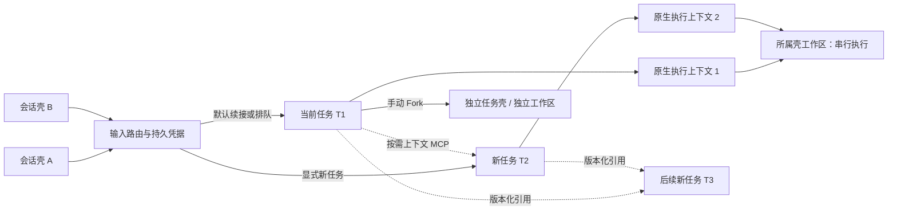

# 任务会话壳：顺序续接、按需上下文与事后归集

更新：2026-09-08。状态：已固化为普通聊天的消息入口；确定性、隔离宿主及真实 Chrome 验收见 [发布测试记录](task-shell-release-tests.md)。真实模型的效果、成本和长期稳定性仍需启用后的试用数据。

任务壳持有服务端权威 `currentTaskId`。普通消息始终顺着最近任务投递；任务占用时进入同一任务队列，不再自动分叉。会话内点击「新任务」会创建新的任务及原生执行上下文，仍使用该会话壳的工作区。同壳执行串行；在任务板手动 Fork 才创建独立任务壳和独立工作区。每轮默认不注入其他任务历史，模型只有在当前上下文不足时才能调用只读 MCP `get_task_context` 回补带来源及执行状态的历史。

任务归属与执行会话是两种身份。X1 先在游标 B 的会话执行，随后 Aux 可将 X1 及其回复归到 A、B 或新任务 C，并更新 `currentTaskId`；下一条普通消息进入归集后的任务会话。失败、部分输出、取消、等待及写操作都不是禁止归集的条件。历史记录和工具操作仍保留在原执行会话，不搬动原生线程或工作区；归属视图按消息的 taskId 跨会话聚合。新任务执行会话在首次投递时创建，并带上 X1 的证据。

## 1. 使用与路由

普通 Web 聊天进入任务会话壳；任务板的会话来源任务打开只读预览，提供「返回原会话」「Fork 为独立任务」。独立任务可从任务板执行；不再需要 `MULTICC_TASK_SHELLS`，设置为 `0` 也不会回到旧实现。页面加载失败会显示错误，不会切换到旧任务投影视图或旧发送路径。

已有会话以关联方式纳入：保留原生 ID、工作区、聊天历史和待回答问题身份。打开壳时自动采用已有/最近任务；空白会话幂等创建一个任务身份。Web 的完整聊天窗口按壳聚合旧历史与新进展，执行切换不更换页面 URL；刷新及向上分页继续读取同一壳。生成的 task-… 执行链接回到其来源壳，删除和 fork 消息仍使用来源 execution/message ID。

App 的 WebSocket 消息携带 `taskShell:true`，由同一壳运行时生成持久凭据；它只是协议适配，不再自行决定入队。App 收到 `task_shell_routed` 后跟随实际执行会话，断线重试保留原消息键，回答和取消捕获原 turnId。旧版 App 不含该协议，需要更新客户端；无标记的旧普通聊天写入会明确拒绝。系统/网关专用控制和宿主内部恢复仍保持其原协议。

每个壳可以关联同项目的多个任务，多个壳可以关联同一任务。`currentTaskId` 持久化在服务端；浏览器 URL 和 sessionStorage 不再拥有路由决定权。

| 输入 | 行为 |
| --- | --- |
| 普通发送 | 投递到服务端 `currentTaskId`；占用时排入同一任务 |
| Commander 携带明确 taskId | 同所有者任务可以明确投递；其他壳的关联仅为历史引用，不能夺取执行权 |
| 从任务板点击会话来源任务 | 只读查看，不移动来源壳游标、不占用执行；继续原任务须返回原会话 |
| 手动 Fork 为独立任务 | 新任务卡、新任务 ID、新壳、新工作区，原任务及来源壳不变 |
| 会话内点击「新任务」后发送 | 新任务、新隐藏原生执行上下文，共用所属壳工作区 |
| 模型调用 `get_task_context` | 回补壳内任务的有界历史；可按 task_id 查询、before 翻页、message_id/offset 读取长消息，并将本轮节省 token 记为 0 |
| 回合被 Aux 判为其他/新任务 | 保存本轮交接证据并更新 `currentTaskId`，下一轮进入对应任务会话；不以成功或只读作为条件 |
| 调整当前任务 | 捕获原 taskId + turnId，经现有调度器续接；不会分叉，不承诺立刻中断 CLI |
| 回答当前问题 | 捕获原 taskId + turnId + requestId；跨壳同问题只预留一个答案 |
| 停止当前回合 | 精确校验显示时的 turnId；过期操作拒绝 |
| 超时 / 失败后重试 | 保留原消息键、目标任务和内容；不重新决定分叉 |
| API 新任务引用存档 | 内部接口最多显式引用 3 个已关联任务的完成回合，不合并任务；普通前端不展示该高级入口 |
| API 所选引用必须完成 | 未达到完成状态则返回 `dependency_not_ready`，不创建执行；结果就绪后重新发送 |

任务选择不再是普通发送的前置操作。模型归集修改任务归属，不修改历史操作发生的位置；回答、调整和取消仍捕获原 taskId/turnId，依赖等待仍是明确拒绝后重试，尚无自动依赖 DAG 调度。

## 2. 结构与所有权

| 实体 | 权威内容 |
| --- | --- |
| 现有任务板 | 任务身份索引、展示标题、状态、隐藏聊天绑定 |
| 现有聊天历史服务 | 任务正式消息和完整工具证据；保留原输入，不把上下文 seed 写成用户消息 |
| `task-shells.sqlite` 的 shell / link | 来源交互入口、项目边界、多对多关联 |
| task 绑定元数据 | 固定执行 sessionId、归集来源、引用版本、创建时 Git 基线、允许继承的运行配置 |
| snapshot | 不可变历史证据、来源 execution/message ID、状态、工具证据、SHA-256、节选及省略信息 |
| receipt / claim / answer | 原输入的投递凭据、占用预留、问题一次结算预留 |
| 现有持久 scheduler / outbox | 真实入队、进程执行、回合关联、恢复与投递去重 |
| 原生 JSONL | CLI 执行缓存，保持原有管理；不并发改写或复制它 |

SQLite 使用 `FULL` 同步与 WAL，文件权限 0600；通过同步事务先确定目标和预留，再执行异步工作区创建。数据库只由当前宿主服务管理；不是多宿主共享数据库方案。

两次持久化边界之间采用稳定键协议：先保存 receipt，再以 receipt ID 写现有 outbox。入队成功但响应丢失时，同键重试读取既有条目；回合或待回答问题已变化也不能把旧回答重新解释成新输入。失败保留原目标和脱敏错误。预留创建故障由同键重试恢复，不启动额外后台恢复循环。

## 3. 快照与工作区

事后归集的交接快照由准确的 turnId / anchorMessageId 定位，包括用户请求与 partial/error/cancelled 等真实状态。超长证据以带来源游标的节选交接，绝不换成另一段旧的已完成问答。默认最多保留最近 10 条、约 12000 字符的正文证据；完整原文通过 MCP 分段查询。工具证据是历史资料，不重新执行。显式依赖引用仍遵守原来的完成条件。

显式新任务不自动继承当前任务，只有用户明确引用或事后归集产生的交接快照才进入新会话。`get_task_context` 默认汇总其他关联任务的非运行中历史，约 60 KB；按 task_id 查询时从整个壳按归属查找，包含写在其他任务执行会话中的消息。分页和长消息分段读取限制返回量；运行中的证据带 inProgress 标记。快照不递归展开祖先。启动前检查内容哈希，缺失或损坏时拒绝恢复。

每个壳拥有一个工作区。普通会话内的隐藏执行记录通过 `workspaceOwnerSessionId` 指向来源壳，原生线程仍各自独立；调度器按工作区所有者分组串行投递。手动 Fork 使用来源 HEAD 创建独立工作区，继承有界历史及 CLI、模型、provider、effort、agent 配置，不复制原生线程 ID、进程或待回答问题。

新建壳执行会话的 `autoCommit=false`，关闭宿主的自动提交 / 合并；任务身份合并 API 拒绝壳任务。用户明确发起的仓库操作仍遵守原有授权与 Git 规则。

## 4. 改动范围

| 文件 / 模块 | 变动与影响 |
| --- | --- |
| `src/task-shell/{store,context,runtime,host,routes}.js` | 持久壳状态、路由、快照、宿主适配和 HTTP API |
| `src/paths.js`、运行时写入治理清单 | 新增数据根内 SQLite 路径，独立于原数据库 |
| `server.js` | 小范围组合接线、内部创建参数允许关闭 autoCommit、关闭时释放 SQLite |
| `src/task-context-host.js`、`src/chat/turn-engine.js` | 入队 / 执行前身份门禁、冷启动 seed、未带壳协议的旧 WS 写入拒绝 |
| `src/chat/turn-request.js`、`src/task-board.js` | 声明可信 `task-shell` 来源，避免实际执行被拒为 invalid_task |
| `src/session-work-host.js`、`src/session-work-scheduler.js`、`src/orchestration-runtime.js` | 对携带壳凭据的投递启用严格回合 / 问题校验和跨回合重试；普通聊天入口统一进入壳 |
| `src/routes/task-board.js`、`src/task-board-merge-runtime.js` | 注册任务索引，保护任务身份不合并 |
| `public/task-shell*` | 新壳页面、稳定请求客户端、默认续接 / 显式新建 / 回答控制和 token 提示；2 秒可见页轮询正式历史和状态 |
| `public/chat-context-controls.js`、`public/chat.js` | 普通聊天直接进入壳，删除旧投影视图和回退 |
| `app/assets/i18n/{zh,en}.json` | 共享词条；Web catalog 由脚本生成 |
| `tests/test-task-shell*`、调度回归用例、package scripts | 单元、HTTP、故障、隔离假 CLI、Chrome 浏览器验收 |

新增 API 位于 `/api/task-shells`，经过现有主应用认证，不为公开分享授权开放。任务 / 引用强制同项目且先关联。API 不接受 CLI 状态、任意路径、原生会话 ID 或跨项目拷贝参数。旧入口向新建壳执行会话投普通输入会返回 `task_shell_route_required`；原系统回调 / 重试保持原执行会话身份。

## 5. 副作用与边界

1. **额外资源与费用。** 手动 Fork 增加工作区；实际执行才产生模型费用。本版每项目最多 4 个占用壳任务、200 个任务；超并发限制时返回可重试容量错误，并保留原目标。等待问题和未知状态也保守计入占用；回答 / 取消不被容量门槛阻断。
2. **上下文滞后与截断。** 默认回补排除当前仍运行的回合，主动分页可查并看到 inProgress 标记。交接保留失败/部分输出状态，长证据明确标为节选并提供原文游标。任务板预览聚合归属历史，完整聊天壳支持分页。
3. **语义与代码基线不同。** 可以知道另一任务的结论，但新工作区不自动拥有其未合入的代码。这一事实明确写进 seed；不能用上下文共享代替代码集成。
4. **结论可能冲突。** 引用保留出处和版本，不会自动生成一份覆盖所有分支的权威摘要。模型仍可能误解引用，需要后续真实案例评估。
5. **故障时保守占用。** 创建 / 入队无法确认时保留凭据。同键重试恢复；不会默默换目标。已发往外部系统的工具副作用仍不能承诺 exactly-once。
6. **显示有延迟。** 任务页轮询正式历史，最长约两秒刷新；不是新的 token 级流式渲染器。完整聊天渲染保留用于只读历史和系统会话；App 输入复用壳运行时。
7. **身份迁移有限。** 普通聊天的 CLI 选择沿用现有适配器；旧会话关联保留其原生上下文。普通会话可在回合后归集，独立任务保持固定任务身份；自动依赖调度仍未实现。
8. **持久数据会增长。** 本版无自动任务 / 快照 GC，不删除原生历史。移除仍拥有任务的壳仅归档，保留所有权与历史引用；应纳入已有数据目录备份。SQLite 运行时备份应使用 SQLite backup 或一致性停机备份，不能只复制活跃主文件而忽略 WAL。

## 6. 上线

合入后由用户手动重启服务并刷新 Web 页面；本次不自动重启线上服务。实验开关及“关闭后走旧链路”的代码已经删除。旧数据不删除，SQLite、隐藏聊天历史和工作区继续使用。

普通聊天的消息处理统一为：输入 → 壳当前任务 → 持久 receipt → 现有 scheduler/outbox → 执行会话 → Aux 归集 → 更新壳当前任务。排队、显式新建、回答/取消校验、同键重试和上下文回补审计都由 `src/task-shell/runtime.js` 决定。

验证包括 Node 全量测试、旧会话/待答身份迁移单元测试、隔离宿主的同键重试与原生身份测试、Chrome 页面与移动布局验收，以及 App 消息协议与重连回归。

## 2026-09-07 回归验证

- `tests/test-shell-chat-continuity.js`：X1 在 B 执行后归入 C，部分失败证据交接、继续 C、归回 A、迟到分类不覆盖较新输入、长消息原文读取。
- `MULTICC_SHELL_BROWSER_TEST=1 node tests/test-task-shell-isolated.js`：真实 Chrome 验证旧/新历史、内部切换、刷新分页、生成执行链接恢复及来源消息操作。
- `node tests/test-task-shell-context-isolation.js`：真实 MCP 协议验证按需回补、原生上下文续接、项目隔离和服务重启恢复。

本次不重写已产生的错误原生上下文，也不搬动未提交代码。部署后需重启服务加载新的 API 和 MCP 契约。

## 2026-09-08 任务板只读与手动 Fork

任务的所有者固定。会话来源任务在 Web/App 任务板只读，服务端拒绝发送、回答、调整和停止；返回原会话后可继续执行。只读入口不创建执行、不改变游标。手动 Fork 才生成新的独立任务，原卡片仍属于原会话，不自动扶正或搬迁。

Fork 冻结至多 10 条、约 12,000 字符的上下文证据和来源提交。来源或同工作区执行仍运行时拒绝；存在未提交文件时提示先提交。稳定请求键保证响应丢失、重启及创建失败重试不会重复创建；创建本身不调用模型。

旧版每任务工作区不会被直接删除。旧目录有未提交文件或未合入基分支的提交时拒绝重绑，须先保存并合入；安全迁移保留旧目录记录、清除原生线程缓存，在来源壳目录开始新的原生上下文。共享成员不单独休眠工作区；所有者有成员引用时禁止删除。保留的旧目录暂不提供自动清理。

新增接口：GET /api/task-shell-tasks/:taskId 为只读预览；POST .../fork 为幂等创建；POST .../messages 仅允许独立任务执行。迟到投递和旧页面游标不能覆盖更新后的任务选择。

验证覆盖：真实临时 Git 项目的独立 Fork 目录与执行、同壳串行和原生上下文隔离、重启恢复、Chrome 只读/Fork/移动布局、App 分析及任务板回归。
