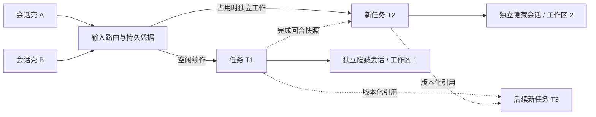

# 任务会话壳：唯一消息入口、分叉执行与版本化上下文

日期：2026-09-06。状态：已固化为普通聊天的消息入口；确定性、隔离宿主及真实 Chrome 验收见 [发布测试记录](task-shell-release-tests.md)。真实模型的效果、成本和长期稳定性仍需启用后的试用数据。

本版替代之前设计中的「多个壳向忙任务默认排队」「完成后必建 epoch」「分叉后汇合」设想。实现遵循用户最后确认的规则：空闲继续；占用时独立工作分叉；各分支不汇合；后续新任务按需引用完成上下文。

## 1. 使用与路由

普通 Web 聊天和任务详情链接直接进入任务会话壳；不再需要 `MULTICC_TASK_SHELLS`，设置为 `0` 也不会回到旧实现。页面加载失败会显示错误，不会切换到旧任务投影视图或旧发送路径。

已有会话以关联方式纳入：保留原生 ID、工作区、聊天历史和待回答问题身份。已有任务空闲时续作，占用时独立工作分叉；迁移前已持久入队的工作继续执行。新建空白壳的第一条工作创建独立隐藏执行会话。壳中提供原聊天记录的只读入口。

App 的 WebSocket 消息携带 `taskShell:true`，由同一壳运行时生成持久凭据；它只是协议适配，不再自行决定入队。App 收到 `task_shell_routed` 后跟随实际执行会话，断线重试保留原消息键，回答和取消捕获原 turnId。旧版 App 不含该协议，需要更新客户端；无标记的旧普通聊天写入会明确拒绝。系统/网关专用控制和宿主内部恢复仍保持其原协议。

每个壳可以关联同项目的多个任务，多个壳可以关联同一任务。当前任务选择保存在浏览器当前标签页，后台输出不会改变选择。

| 输入 | 行为 |
| --- | --- |
| 选择新建独立任务 | 新任务、新隐藏执行会话、新工作区 |
| 选择空闲任务，发送独立工作 | 沿用任务与原生会话 |
| 选择占用任务，发送独立工作 | 从完成历史快照创建分支，源任务继续执行 |
| 调整当前任务 | 捕获原 taskId + turnId，经现有调度器续接；不会分叉，不承诺立刻中断 CLI |
| 回答当前问题 | 捕获原 taskId + turnId + requestId；跨壳同问题只预留一个答案 |
| 停止当前回合 | 精确校验显示时的 turnId；过期操作拒绝 |
| 超时 / 失败后重试 | 保留原消息键、目标任务和内容；不重新决定分叉 |
| 新任务引用存档 | 最多显式引用 3 个已关联任务的完成回合，不合并任务 |
| 所选引用必须完成 | 未达到完成状态则返回 `dependency_not_ready`，不创建执行；结果就绪后重新发送 |

本版没有启用模型自动归集意图。用户通过可见任务选择和独立工作 / 调整 / 回答入口表达关系。特别是「忙时分叉」只用于独立工作；依赖、回答和调整有单独语义。依赖等待是明确拒绝后重试，尚无自动依赖 DAG 调度。

## 2. 结构与所有权

| 实体 | 权威内容 |
| --- | --- |
| 现有任务板 | 任务身份索引、展示标题、状态、隐藏聊天绑定 |
| 现有聊天历史服务 | 任务正式消息和完整工具证据；保留原输入，不把上下文 seed 写成用户消息 |
| `task-shells.sqlite` 的 shell / link | 来源交互入口、项目边界、多对多关联 |
| task 绑定元数据 | 固定执行 sessionId、分叉来源、引用版本、创建时 Git 基线、允许继承的运行配置 |
| snapshot | 不可变完成回合快照、原消息 ID、工具证据、SHA-256、省略回合数 |
| receipt / claim / answer | 原输入的投递凭据、占用预留、问题一次结算预留 |
| 现有持久 scheduler / outbox | 真实入队、进程执行、回合关联、恢复与投递去重 |
| 原生 JSONL | CLI 执行缓存，保持原有管理；不并发改写或复制它 |

SQLite 使用 `FULL` 同步与 WAL，文件权限 0600；通过同步事务先确定目标和预留，再执行异步工作区创建。数据库只由当前宿主服务管理；不是多宿主共享数据库方案。

两次持久化边界之间采用稳定键协议：先保存 receipt，再以 receipt ID 写现有 outbox。入队成功但响应丢失时，同键重试读取既有条目；回合或待回答问题已变化也不能把旧回答重新解释成新输入。失败保留原目标和脱敏错误。预留创建故障由同键重试恢复，不启动额外后台恢复循环。

## 3. 快照与工作区

快照只包含有完整 assistant 结尾的已完成回合；排除当前回合、interim、partial、cancelled 和 error。每来源最多保留约 12 KB 的完整回合，超限按回合省略，界面显示来源、哈希、保留与省略数量。工具调用 / 结果作为历史资料注入，不重新执行。

新分支记录 parentTaskId 作为来源，不建立结果回传或合并义务。新任务最多显式引用三个任务，加上忙时分叉的来源。快照不递归展开祖先；需要更早依据时应显式引用相应任务。启动前检查内容哈希；缺失 / 损坏时拒绝恢复。新原生上下文还会加入本任务已有的有界完成历史；已有原生上下文续作不重复注入 seed。

每任务通过现有 `createSessionRecord` 得到独立 Git worktree。记录的是新工作区实际 HEAD；不会复制来源未提交文件，也不承诺已经包含来源分支的代码变更。来源代码若未进入基分支，需要用户另行选择代码交付流程。继承项仅 CLI、模型、provider 选择、effort、agent；不复制原生 ID、进程、待回答问题、来源壳私有记忆和角色提示正文。

新建壳执行会话的 `autoCommit=false`，关闭宿主的自动提交 / 合并；任务身份合并 API 拒绝壳任务。用户明确发起的仓库操作仍遵守原有授权与 Git 规则。

## 4. 改动范围

| 文件 / 模块 | 变动与影响 |
| --- | --- |
| `src/task-shell/{store,context,runtime,host,routes}.js` | 持久壳状态、路由、快照、宿主适配和 HTTP API |
| `src/paths.js`、运行时写入治理清单 | 新增数据根内 SQLite 路径，独立于原数据库 |
| `server.js` | 小范围组合接线、内部创建参数允许关闭 autoCommit、关闭时释放 SQLite |
| `src/task-context-host.js`、`src/chat/turn-engine.js` | 入队 / 执行前身份门禁、冷启动 seed、未带壳协议的旧 WS 写入拒绝 |
| `src/chat/turn-request.js`、`src/task-board.js` | 声明可信 `task-shell` 来源，避免实际执行被拒为 invalid_task |
| `src/session-work-host.js`、`src/session-work-scheduler.js`、`src/orchestration-runtime.js` | 对携带壳凭据的投递启用严格回合 / 问题校验和跨回合重试；普通聊天入口统一进入壳 |
| `src/routes/task-board.js`、`src/task-board-merge-runtime.js` | 注册任务索引，保护任务身份不合并 |
| `public/task-shell*` | 新壳页面、稳定请求客户端、任务 / 回答 / 引用交互；2 秒可见页轮询正式历史和状态 |
| `public/chat-context-controls.js`、`public/chat.js` | 普通聊天直接进入壳，删除旧投影视图和回退 |
| `app/assets/i18n/{zh,en}.json` | 共享词条；Web catalog 由脚本生成 |
| `tests/test-task-shell*`、调度回归用例、package scripts | 单元、HTTP、故障、隔离假 CLI、Chrome 浏览器验收 |

新增 API 位于 `/api/task-shells`，经过现有主应用认证，不为公开分享授权开放。任务 / 引用强制同项目且先关联。API 不接受 CLI 状态、任意路径、原生会话 ID 或跨项目拷贝参数。旧入口向新建壳执行会话投普通输入会返回 `task_shell_route_required`；原系统回调 / 重试保持原执行会话身份。

## 5. 副作用与边界

1. **额外资源与费用。** 分叉增加工作区和模型上下文成本。本版每项目最多 4 个占用壳任务、200 个任务；超并发限制时返回可重试容量错误，并保留原目标。等待问题和未知状态也保守计入占用；回答 / 取消不被容量门槛阻断。并发门槛仅约束壳内用户工作，不替代整个宿主的资源管理。
2. **上下文滞后与截断。** 来源仍在进行的工作不进入快照；引用过长会按完整回合省略。省略是可见的，正式原历史仍保存。任务页目前显示最近 200 条消息，不是归档浏览器。
3. **语义与代码基线不同。** 可以知道另一任务的结论，但新工作区不自动拥有其未合入的代码。这一事实明确写进 seed；不能用上下文共享代替代码集成。
4. **结论可能冲突。** 引用保留出处和版本，不会自动生成一份覆盖所有分支的权威摘要。模型仍可能误解引用，需要后续真实案例评估。
5. **故障时保守占用。** 创建 / 入队无法确认时保留凭据。同键重试恢复；不会默默换目标。已发往外部系统的工具副作用仍不能承诺 exactly-once。
6. **显示有延迟。** 任务页轮询正式历史，最长约两秒刷新；不是新的 token 级流式渲染器。完整聊天渲染保留用于只读历史和系统会话；App 输入复用壳运行时。
7. **身份和上下文迁移有限。** 普通聊天的 CLI 选择沿用现有适配器；旧会话关联保留其原生上下文。语义自动归集和自动依赖调度仍未实现。
8. **持久数据会增长。** 本版无自动任务 / 快照 GC，不删除原生历史。移除壳只拆关联，任务与其他壳继续存在；应纳入已有数据目录备份。SQLite 运行时备份应使用 SQLite backup 或一致性停机备份，不能只复制活跃主文件而忽略 WAL。

## 6. 上线

合入后由用户手动重启服务并刷新 Web 页面；本次不自动重启线上服务。实验开关及“关闭后走旧链路”的代码已经删除。旧数据不删除，SQLite、隐藏聊天历史和工作区继续使用。

普通聊天的消息处理统一为：输入 → 壳路由 → 持久 receipt → 现有 scheduler/outbox → 执行会话。任务空闲续作、忙时分叉、回答/取消校验、同键重试都由 `src/task-shell/runtime.js` 决定。`public/chat-task-mode.js` 的旧投影发送实现已删除。

验证包括 Node 全量测试、旧会话/待答身份迁移单元测试、隔离宿主的同键重试与原生身份测试、Chrome 页面与移动布局验收，以及 App 消息协议与重连回归。
